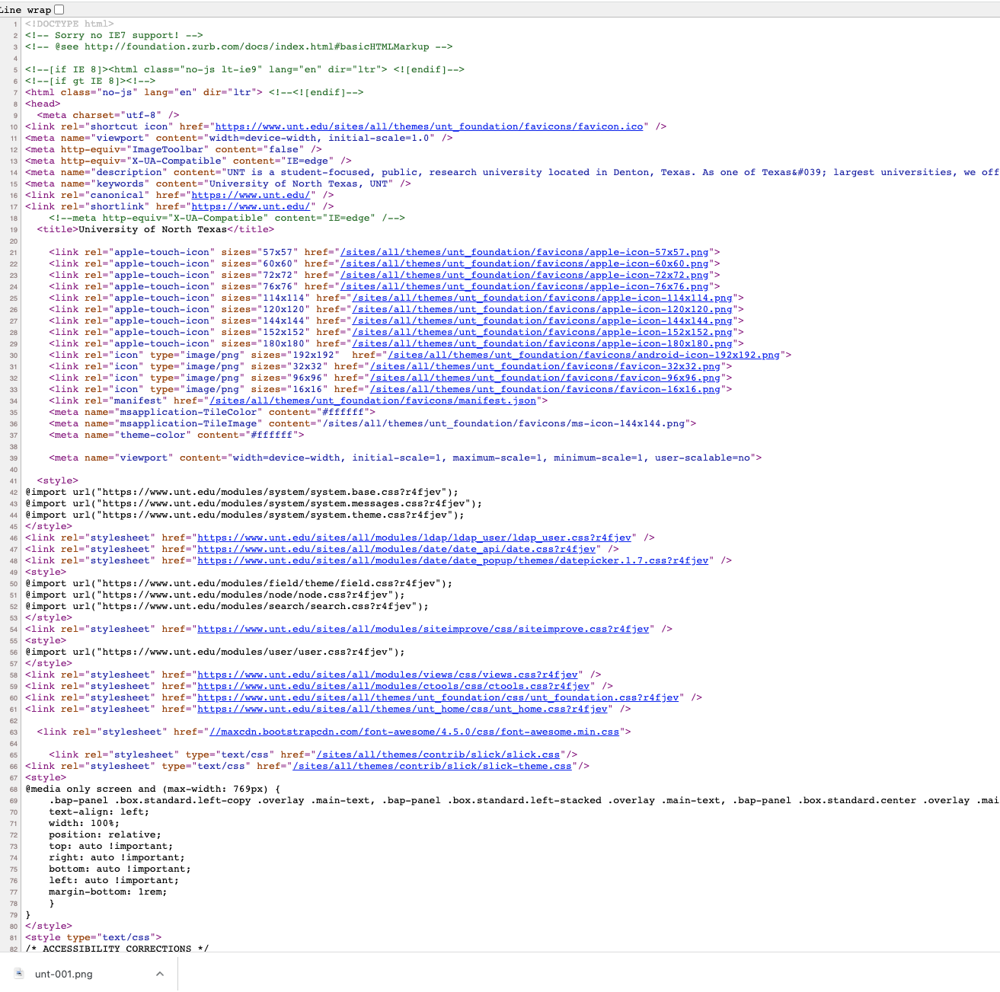

# Module Two - What is the Web?

## Module Two - Overivew and Objectives

### Overview: 
This week we are going to be looking at the building blocks that make up the web. Having a basic familiarity of how the web works is important as we begin to discuss web archiving. 

There are several short vides to watch as well as some readings that provide an overview of common web components such as HTTP, URLS, HTML and HTTP Headers.

### Objectives:
1. Become familiar with building blocks of the web.
2. Understand how the Web and the Internet are related but different.
3. Become familiar with the basics of HTML and how to source of websites.

## Module Two - Readings

### Web Architecture

* Computerphile. _Web vs Internet (Deep Dark Web Pt1)_ (June 17, 2016) - https://www.youtube.com/watch?v=oiR2mvep_nQ
* Eye on Tech. _What is a URL? URL Components and How it Works_ (January 8, 2020) https://www.youtube.com/watch?v=-LPe4tYckkg
* Computer Hope. URL (December 5, 2021) https://www.computerhope.com/jargon/u/url.htm
* CoffeeCup Software. _Absolute Vs. Relative Paths/Links_ (September 6, 2017) https://www.coffeecup.com/help/articles/absolute-vs-relative-pathslinks/ 
* Mozilla. _"An Overview of HTTP"_ https://developer.mozilla.org/en-US/docs/Web/HTTP/Overview 
* WebConcepts. _Web Server Concepts and Examples_ (October 5, 2020). https://www.youtube.com/watch?v=9J1nJOivdyw 
* SoftwareEngenius. _Learn in 5 Minutes: Http Headers (General/Request/Response/Entity)_ (July 31, 2020) https://www.youtube.com/watch?v=1v7RoeXyww4
* Fieldings, et. al. _RFC 2616 Section 10. Status Code Definitions._ https://www.w3.org/Protocols/rfc2616/rfc2616-sec10.html (Links to an external site.)  

### Further Readings (and Videos) 

* Jake Wright. _Learn HTML in 12 Minutes_ (Nov 10, 2010). https://www.youtube.com/watch?v=bWPMSSsVdPk 
* Computerphile. SGML HTML XML What's the Difference? (Part 1) (Apr 13, 2016). https://www.youtube.com/watch?v=RH0o-QjnwDg
* Computerphile. HTML: Poison or Panacea? (HTML Part 2) (Apr 22, 2016). https://www.youtube.com/watch?v=Q4dYwEyjZcY
* Mozilla Getting started with HTML  - https://developer.mozilla.org/en-US/docs/Learn/HTML/Introduction_to_HTML/Getting_started
* Tim Burners-Lee Information Management: A Proposal (March 1989) - https://www.w3.org/History/1989/proposal.html
* Ben Cotton. 6 RFCs for understanding how the internet works (And three for fun) (July 6, 2018) - https://opensource.com/article/18/7/requests-for-comments-to-know
* The Internet Society. Hypertext Transfer Protocol -- HTTP/1.1 (June 1999) - https://datatracker.ietf.org/doc/html/rfc2616

## Module Two - HTML Exercise

### HTML Exercise

Visit either https://texteditor.com/html/editor/  or https://htmlfiddle.net/  and experiment with what happens when you are using the What You See Is What You Get (WYSIWYG) text editor.  In one side of the page you can type text, add formatting and you will see what the HTML markup is doing on the other side of the screen. Make sure you try to make several paragraphs, add some links and an image to see what happens.  Finally experiment with different formats like bold, italics, lists and maybe a table.  The goal is to see the different tags that are being created in the html. 

### View the Source
The next exercise is to become familiar with ways of viewing the source of the HTML pages you are using all the time in your web browsers.  Most browsers will have a way of viewing the source HTML code that is used to render the pages you are looking at.  This will include the links, images, stylesheets, javascript, and other markup needed to add structure, design, and interactivity to the webpages you are viewing online.  

Viewing the source is actually fairly easy on browsers, if you right click with you mouse on the page you are looking at, you will see an option that says something like "View Page Source".  When you click on this option your browser will open a new tab and will show you what HTML makes up the page you are on. 

In looking at a few browsers on my Mac, here is what the options say that you should click on. It might be slightly different on another browser and operating system. 

* Chrome - View Page Source
* Firefox - View Page Source
* Safari - Show Page Source

#### Example of what you should see
For a website like https://unt.edu you might see this in your browser. 

If you click on this page and view the source code you will see something that looks like this. 

### Exploring Web Archives

This week we will be looking at the web archives of the Library of Congress. 

Pay attention to how the archived web sites are organized. 

What is the difference in this presentation of an archived website and collection of those sites?

* Web Archiving - About this Program - https://www.loc.gov/programs/web-archiving/about-this-program/ 
* Collections with Web Archives - https://www.loc.gov/web-archives/collections/ 
* Web Archives - https://www.loc.gov/web-archives/collections/ (Links to an external site.) 

## Discussion 

### Discussion Post:
In at least one paragraph, discuss what you learned about the components that are used together to build the web as we know it.  What areas were you most or least familiar with before this weeks readings? Are there pieces that you would like to learn more about?

In at least one paragraph, discuss collections you discovered at the Library of Congress? Were you surprised by what you found there? Are there things you think are missing based on your exploration of the web archive holdings? What would you like to know more about in relation to the Library of Congress Web Archives? Please include links to the specific sites you reference including links into the web archives themselves. One of the goals of this course is to become comfortable with linking into web archives and making them an active part of your online experience. 

Note: It is easy to go astray in the Library of Congress Collections.  Make sure that what you are looking at are web archives, and not archival collections on the web.  

### Class Engagement: 
After you have made the discussion post described above, take the time to response, comment, or engage with at least two of your classmates posts.  

If there are any unanswered questions feel free to try and offer an answer or suggestion to the original poster.  Did they mention something that made you investigate something further? If so, what was it? 
