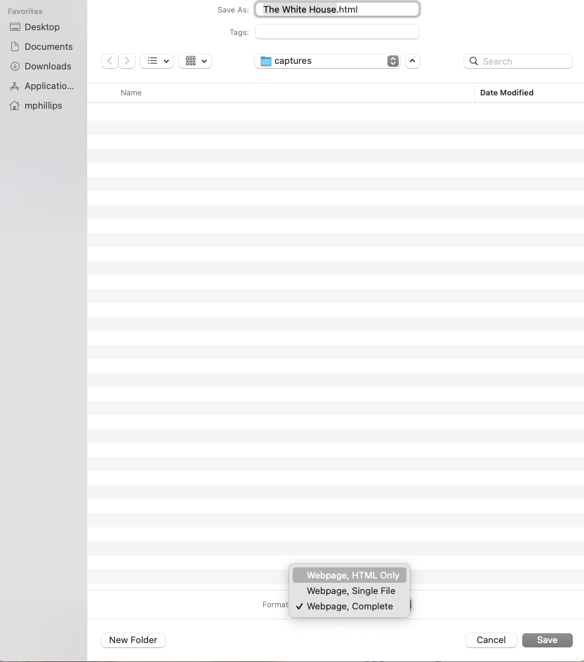

# Module Four - Technology Overview

## Overview and Objectives 

### Overview:
The web is a growing and changing environment. Because of this constant change, the tools and processes used to harvest, capture, and archive the web also have to change in order to keep up. This module will introduce you to the major components involved in the web archiving process including capture or harvest, replay or playback, and finally discovery and access.

Future modules will discuss these concepts in greater detail.

There are several readings and a longer video recorded in 2019 to watch that will present the major components of technology used in web archiving.

There is a graded discussion for this module. 

### Objectives:
1. Be able to identify the high-level technology components related to web archiving. 
2. Begin to learn about the different components and their primary uses. 
3. Begin to understand some of the limitations present in harvesting resources from the web.

## Readings

* Niu, j. (2012). An Overview of Web Archiving. _D-Lib Magazine_. 18(3/4) https://doi.org/10.1045/march2012-niu1 
    * This article provides a good overview of the components in the web archiving space.
* Texas Digital Library (2019). Intro to Web Archiving Texas #1 Web Archiving Technology, Tools & Resources - https://www.youtube.com/watch?v=vkSKPQccuMg 
    * Mark Phillips, Associate Dean for Digital Libraries, University of North Texas
    * Courtney Mumma, Deputy Director, Texas Digital Library
    * Lauren Ko, Supervisor, Software Development Unit, University of North Texas
* International Internet Preservation Consortium (2022). _ Awesome Web Archiving_ - https://github.com/iipc/awesome-web-archiving 
    * Skim this list of tools and technologies for web archiving.
    * Follow a few different links and explore. (You will need to pick one for the discussion this week)
* Hockx-Yu, H. (2009) Web Archiving Tools: An Overview - https://www.dpconline.org/docs/miscellaneous/events/394-0907hockxyumissing-links/file 
    * This presentation does a great job of presenting a wide range of concerns related to the UK Web Archive.

## Archiving Exercise

### Web Archiving Exercise - Browser Based "Save As"
In a previous module we looked at the HTML that makes up the web pages that we view in our browsers.  We learned how to "view source" on a page and see the underlying code. 

In this exercise we will look at how a browser can be used to save web content to your local machine. 

Most browsers have the ability to save a web page to your local machine. 

This is found in one of two places. first you can look in the File dropdown at the top of your browser. The exact wording will be different depending on which browser and operating system you use, but on a Mac with Chrome I see "Save Page As".

Another option is to right click on the page you are interested in saving and you will see something like "Save as" (again using Chrome on a Mac)

You will generally have two different options when you save an HTML file from your browser (though sometimes there are more). They will be some variation of "HTML Only" and "Complete"

Example save dialog from Chrome on a Mac.

### Exercise

Pick an HTML page, ideally the homepage of an agency or organization. 

0. (just a hint) I like to create a new empty folder on my Desktop named something like "captures" so that when I'm trying to find this stuff later, it doesn't get all confused in my normal Downloads folder.  As you are saving files you will need to navigate to this folder on your desktop but in the long run it will be easier to deal with.
1. Using Save As, first save the HTML file as "HTML only".  Pay attention where on your hard drive you save the file.  Next navigate to that location and try and open the file in your browser.  Does the page display the same as the "live" version? What does the URL bar in your browser display for the "URL"?, What happens when you click on links, what displays in the URL after you click a link?
2. Going back to the homepage you chose (and not your saved copy), this time save the HTML file as "complete" or "all files".   Pay attention where on your hard drive you save the file. Again navigate to the location you saved it and this time notice the different files that are present. In addition to the HTML file, what other files were downloaded? Next, open the file in your browser.  Does the page display the same as the "live" version? What does the URL bar in your browser display for the "URL"?, What happens when you click on links, what displays in the URL after you click a link? What is the file size for all of the files that were downloaded?
3. View the source on these saved HTML versions and compare them to the "view source" on the live website.  Do you notice any differences with the saved pages and the version that is on the web? 

## Exploring Web Archives

Each week we will try and learn about a new web archive, a web archiving tool, or a web archiving service.  The goal of this is to get an introduction to what is happening in the web archiving space, what is being collected, and who is collecting it. 

This week we will look at the Ivy Plus Library Web Collecting Program - https://ivpluslibraries.org/programs/ivy-plus-libraries-confederation-web-collecting-program/

This program uses the Archive-It service for their web archiving activities. 

A gateway into their collections can be found here - https://archive-it.org/home/IvyPlus

Explore the collections that are included in this program.  In the discussion for this week you will describe what you find in these collections, why they are being collected, and the scope of what is being collected.

## Discussion 

### Discussion Post:
In at least one paragraph, discuss what you learned about the technologies involved in the web archiving space. In addition to the big buckets of Capture, Preserve, Playback what other things also should be thought about based on your readings?

What tools did you explore in the Awesome List? Link to the tool and give a brief description of the problem it is trying to solve.

In at least one paragraph discuss the web archive you identified this week in the Ivy Plus Library Web Collecting Program. Include a link to the web archive and discuss some of the types of content you found inside. Was there anything in their collections you hadn't expected? Are there things that you would have thought might be there? Please include links to the specific sites you reference including links into the web archives themselves. One of the goals of this course is to become comfortable with linking into web archives and making them an active part of your online experience. 

Finally, in at least one paragraph, what did you discover in the "Save As" exercise this week?  What website did you capture? What happened when you opened the saved file in your browser? How was the HTML Only different from the other option to save things completely or save all files?  What kinds of files did you see when you saved things? What differences did you notice between the saved versions of the web page and the live version?

### Class Engagement:
After you have made the discussion post described above, take the time to response, comment, or engage with at least **two** of your classmates posts.  

If there are any unanswered questions feel free to try and offer an answer or suggestion to the original poster.  Did they mention something that made you investigate something further? If so, what was it? 
