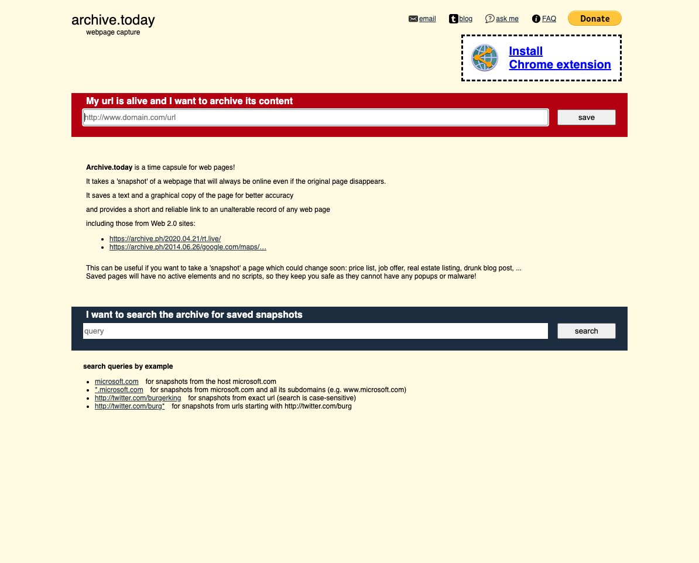

# Module Six - Preserve

## Overview and Objective

### Overview: 
Once you have decided what you are interested in collecting, and after you have decided how to crawl this content you need to think about how you will store and preserve the crawled content. This module will take a deeper look at the process of preservation of content for a web archive, introduce you to some new terms and file formats, and give you a chance to create another web capture with a different tool. 

This will build on concepts that you were introduced to in Module Four. 

There are several readings, some online documentation to skim, a video to watch, and several power points that you will review. 

### Objectives:
1. Become familiar with different approaches to preserving web content.
2. Become familiar with the Web ARCchive (WARC) File Format.
3. Create your second web capture in the https://archive.today service.

## Readings

### Readings

* International Internet Preservation Consortium (2020). Session 3b: Main Concepts and Technologies: Preserve
    * Slides - https://netpreserve.org/download/iipc-training-session-beginners-3b-slides/ 
    * Speaker Notes - https://netpreserve.org/download/iipc-training-session-beginners-3b-notes/ 
    * Review these slides and speaker notes.  I suggest reading the notes when you have the slides open in another part of the screen. 
* Kunze, J. (2005). WARC: an Archiving Format for the Web. International Web Archiving Workshop - https://web.archive.org/web/20120619151338/http://www.iwaw.net/05/kunze.pdf 
* Pennock, Maureen. “Web Archiving” Digital Preservation Coalition Technology Watch Report 13-01 (March 2013) - http://dx.doi.org/10.7207/twr13-01
    * Section 3. Standards (pgs. 17-18)
* International Internet Preservation Consortium (2020). IIPC Training Video Case Study, Topic 7: Web Archiving Tools and Services - https://www.youtube.com/watch?v=MaynKx0_Oow
 
### Web ARChive (WARC) File Format
Skim this documentation and focus on the types of WARC records that can exist. (This is part of this week's discussion)

* International Internet Preservation Consortium. (2022). WARC Specifications. https://iipc.github.io/warc-specifications/ 
    * https://iipc.github.io/warc-specifications/specifications/warc-format/warc-1.1/
    * https://iipc.github.io/warc-specifications/specifications/warc-format/warc-1.1/#warc-record-types 
    * https://iipc.github.io/warc-specifications/specifications/warc-format/warc-1.1/#annex-b-informative-examples-of-warc-records 

Review/Skim the following links to learn more about the WARC File Format. 
* Library of Congress. (2020). WARC, Web ARChive file format. https://www.loc.gov/preservation/digital/formats/fdd/fdd000236.shtml
* The National Archives (2020). Details for: WARC http://www.nationalarchives.gov.uk/pronom/fmt/289  
* Wikipedia - https://en.wikipedia.org/wiki/Web_ARChive 
* International Standards Organization (2009). ISO 28500:2009 Information and documentation — WARC file format. https://www.iso.org/standard/44717.html 
    * **Do NOT buy this standard.  It is for reference only.**
    * Instead, use the public draft before standardization - http://bibnum.bnf.fr/WARC/WARC_ISO_28500_version1_latestdraft.pdf 
* Archive Team (2021) - https://wiki.archiveteam.org/index.php?title=The_WARC_Ecosystem
* ARC Format (precursor of the WARC format) - https://github.com/internetarchive/heritrix3/wiki/ARC%20File%20Format 

### Additional Optional Video
* Consultative Committee for Space Data Systems (CCSDS), Data Archive Interoperability (DAI) Working Group, Kearney, Michael W. III, Giaretta, D., Garrett, J., Hughes, S. (2020 What's missing from WARC? - https://www.youtube.com/watch?v=vdEaz109uAo

## Archiving Exercise

### Saving a Webpage with Archive.Today

This week we are going to save our second webpage in a full web archiving infrastructure. 

This time we turn to a service called Archive.Today.  

You can read more about this service on its Wikipedia page (https://en.wikipedia.org/wiki/Archive.today) 

Start by navigating over to this page https://archive.today, (it most likely will redirect to https://archive.ph , this is fine)

This week we are going to select a webpage and save it using the archive.today service. 

When picking your page to archive keep in mind that you will be describing and linking to it in this weeks discussion post. 

Select a webpage you want to archive, add it to the box that says "My url is alive and I want to archive its content" and hit enter. 

You may be asked to prove you are a robot, once you have done that you will see if the webpage has been archived before or if you are the first to capture it.  If it has been archived before, go ahead and say that you would like to archive it again. 

After you click the "Save" button leave the page open so that you can see what is happening. 

In the discussion this week you will write a paragraph about what you see happening, How many files did you end up collecting that were included in that page? Share any observations you have in the process, and ask any questions you might have about the process. Compare this with tool from the Internet Archive's Wayback Machine. You will need to link to the specific capture you initiated using archive.today in this weeks discussion post.

## Exploring Web Archives 

Exploring Web Archives
Each week we will try and learn about a new web archive, a web archiving tool, or a web archiving service.  The goal of this is to get an introduction to what is happening in the web archiving space, what is being collected, and who is collecting it. 

This week we will look at the Collaborative Collections of the International Internet Preservation Consortium.

Collaborative Collections
* International Internet Preservation Consortium (IIPC). Collaborative Collections - https://netpreserve.org/projects/collaborative-collections/ 
* IIPC Collaborative Collections at Archive-It. - https://archive-it.org/home/IIPC 
* Using IIPC Collaborative Collections WARC data - https://netpreserve.org/iipc-cdg-warc-data/ 
* Thurman, A., & Grotke, A. (2016). Content Development Group & Collaborative Collections Update. - https://digital.library.unt.edu/ark:/67531/metadc1477165/ 

## Discussion

### Discussion Post:
In at least one paragraph, discuss what you learned this week about preservation of web archives and specifically about the WARC format. What were some of the terms or concepts that were new to you this week? What are some things that still need clarity for you?

Looking back at the WARC Specification on Github, it contains some examples of different types of WARC records that are normally seen in a WARC file. In the Appendix B they have these examples listed - https://iipc.github.io/warc-specifications/specifications/warc-format/warc-1.1/#annex-b-informative-examples-of-warc-records . In at least one paragraph, pick one of these record types and in your own words, describe why this kind of record makes sense in the WARC format. How is it used? What is it used for? What kind of information does it contain? Why is this information important?

In at least one paragraph, describe what happened when you used the Archive.Today service. What webpage did you choose to save? Link to your capture of the website at the Archive.Today service. How many files did you end up collecting that were included in that page? Share any observations you have in the process, and ask any questions you might have about the process. 

Finally, in at least one paragraph, discuss the collaborative collection you chose to look at in the IIPC collection. Were you surprised by anything you found in the websites? Are there things that you would have expected that you didn't see? What are some other examples of archives that an international group like the IIPC might want to look at for a collaborative collection in the future? Remember to include links to the collection that you choose as well as examples of archived websites in your post.

### Class Engagement:
After you have made the discussion post described above, take the time to response, comment, or engage with at least **two** of your classmates posts.  

If there are any unanswered questions feel free to try and offer an answer or suggestion to the original poster.  Did they mention something that made you investigate something further? If so, what was it? 
