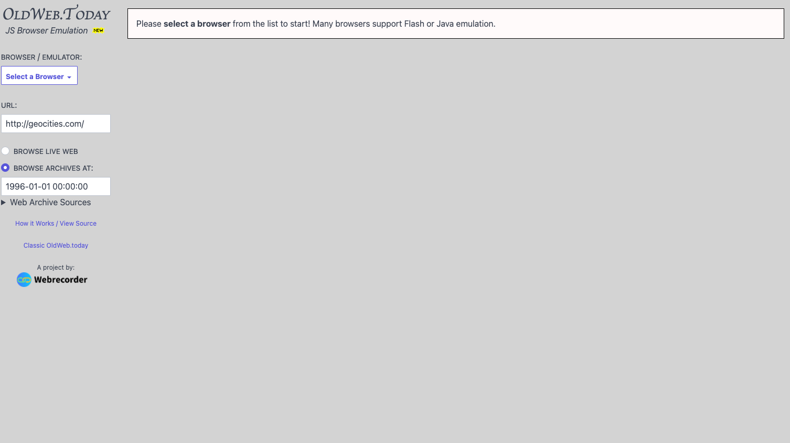
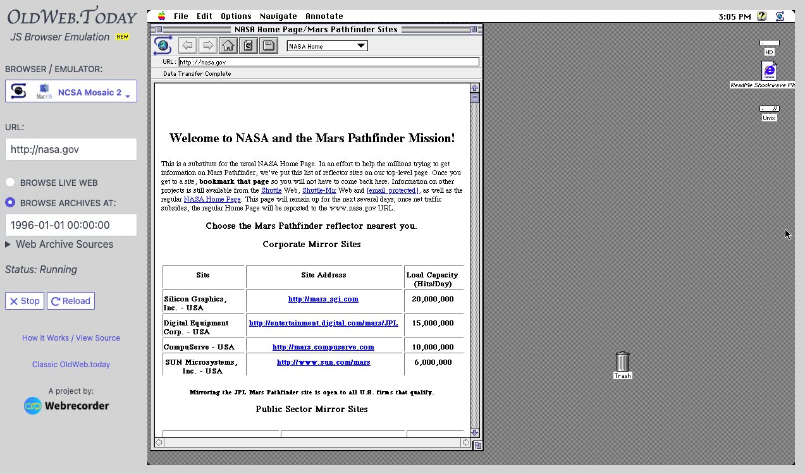

# Module Seven 

## Overview and Objectives

### Overview:

Now that we have learned about standard ways of harvesting and storing web content in a web archive, the next step is providing access to that content. In the web archiving community this is most often referred as **playback** or **replay**. This module will take a deeper look at the some of the fundamentals of how replay works in most web archives. Additionally it will introduce you to some of the standard playback tools such as Open Wayback and pywb. 

This will build on concepts that you were introduced to in Module Six. 

There are several readings, some online documentation to skim, and several power points that you will review. 

### Objectives:

1. Learn the fundamentals of how playback of archived web content works.
2. Become familiar with some of the common software tools for web archive replay.
3. Experiment with different replay environments and combinations of browsers and operating system with https://oldweb.today/  

## Readings

* International Internet Preservation Consortium (2020). Session 3C: Main Concepts and Technologies: Playback 
    * Slides - https://netpreserve.org/download/iipc-training-session-beginners-3c-slides/ 
    * Speaker Notes - https://netpreserve.org/download/iipc-training-session-beginners-3c-notes/ 
    * Review these slides and speaker notes.  I suggest reading the notes when you have the slides open in another part of the screen. 
* Internet Archive (2021). How to use the Wayback Machine. https://www.youtube.com/watch?v=ts1tu1BiSuY 
* Sigurðsson, K. (2020). The Future of Playback. https://netpreserveblog.wordpress.com/2020/06/16/the-future-of-playback/  
* International Internet Preservation Consortium (2020). IIPC Training Video Case Study, Topic 6: Accessing and Using Web Archives.
https://www.youtube.com/watch?v=Dng8d9ytOUc 
* A Short on How the Wayback Machine Stores more Pages than Stars in the Milky Way. http://highscalability.com/blog/2014/5/19/a-short-on-how-the-wayback-machine-stores-more-pages-than-st.html 
    * Technical discussion of how the Wayback Machine Works.

### Software Links
* Wayback Machine on Wikipedia - https://en.wikipedia.org/wiki/Wayback_Machine 
* Webrecorder pywb 2.6 - https://github.com/webrecorder/pywb  
* OpenWayback - https://github.com/iipc/openwayback/ 
* OpenWayback to pywb Transition Guide and pywb update - https://netpreserveblog.wordpress.com/2020/12/16/openwayback-to-pywb-transition-guide/  
* OpenWayback Transition Guide - https://pywb.readthedocs.io/en/latest/manual/owb-transition.html  
* Replay Web.Page - https://replayweb.page/  

## Archiving Exercise

### Web Archiving Exercise - Viewing a website on Old Web Today

This week we will look at viewing websites on older browsers and operating systems. 

The tool that we will be exploring is a web service called Old Web Today https://oldweb.today . 

This tool is developed and maintained by the team that created Webrecorder (https://webrecorder.net/ ) 

The goal of this tool is to more easily allow users to experience websites in the tools and technologies from when websites were captured.

Start by navigating to the website https://oldweb.today/  

**Note**: _I have had mixed results with this service. I think it is very interesting and one of the only ways for us to experience browsers from over twenty years ago.  That being said, it is pretty finicky and can be a bit frustrating.  Try a few different things as experiments and spend at least 15 minutes trying different combinations. _

I suggest starting with the NCSA Mosaic 2 browser.  You can then add a URL that is likely to have existed early in the web.  I chose http://nasa.gov  and was curious about what things looked like back in 1996.

You can select other websites and time periods or even look at a modern website from today on a browser from the past. 

Here is an example that will give you an idea of how things work.  For the activity, please select a different URL for your experiments. 

* About the Mosaic web browser - https://en.wikipedia.org/wiki/Mosaic_(web_browser)  
* NASA website from 1996 on NCSA Mosaic 2 - https://oldweb.today/?browser=nm2-mac#19960101/http://nasa.gov  
* NASA website from 1998 on NCSA Mosaic 2 - https://oldweb.today/?browser=nm2-mac#19980101/http://nasa.gov  
* NASA website from the Live web on NCSA Mosaic 2 - https://oldweb.today/?browser=nm2-mac#http://nasa.gov 

Experiment with different browsers, urls, and switch between the live web and the archived web. 

You have to be patient with all of these emulated systems.  What it is doing behind the scenes (emulating an operating system in Javascript) is pretty cool, but takes patience.  Here is more information about the technology - https://github.com/oldweb-today/oldweb-today 

For the discussion this week you will describe your experience with this system, what you tried to access, how well it did or didn't work and if you were surprised by anything. What is the earliest you can remember accessing websites on the internet.  What tools do you remember? What websites do you remember using?  Finally, what are different uses for a web service like this in the web archiving space?

## Exploring Web Archives

Each week we will try and learn about a new web archive, a web archiving tool, or a web archiving service.  The goal of this is to get an introduction to what is happening in the web archiving space, what is being collected, and who is collecting it. 

This week we will look at the web archives at the End of Term (EOT) Collaborative Web Archive. 

### End of Term Web Archive
* End of Term Web Archive Website - https://eotarchive.org/  
* End of Term Twitter Account - https://twitter.com/eotarchive  
* End of Term Web Archive Wikipedia Page - https://en.wikipedia.org/wiki/End_of_Term_Web_Archive  
Webarchive of Press Releases about the 2016 EOT Web Archive - https://archive-it.org/collections/8311  

### Collected Websites
* Browse 2008, 2012, 2016  - http://eotarchive.cdlib.org/   
* End of Term 2008 - UNT Digital Library - https://webarchive.library.unt.edu/eot2008/  
* End of Term 2012 - UNT Digital Library - https://webarchive.library.unt.edu/eot2012/ 
* End of Term 2016 - UNT Digital Library (UNT Crawls Only) - https://webarchive.library.unt.edu/eot2016/  
* End of Term 2020 - UNT Digital Library (UNT Crawls Only) - https://webarchive.library.unt.edu/eot2020/ 

### Seed Lists for Collection

URL Nomination Tool - https://digital2.library.unt.edu/nomination/  

* End of Term Presidential Harvest 2008 - https://digital2.library.unt.edu/nomination/eth2008/  
* End of Term Presidential Harvest 2012 - https://digital2.library.unt.edu/nomination/eth2012/  
* End of Term 2012 - Bulk Lists - https://digital2.library.unt.edu/nomination/eth2012_bulk/  
* End of Term Presidential Harvest 2016 - https://digital2.library.unt.edu/nomination/eth2016/  
* End of Term 2016 - Bulk Lists - https://digital2.library.unt.edu/nomination/eth2016_bulk/  
* End of Term Presidential Harvest 2020 - https://digital2.library.unt.edu/nomination/eth2020/  
* End of Term 2020 - Bulk Lists - https://digital2.library.unt.edu/nomination/eth2020_bulk/  

### Articles about the End of Term
* Seneca, T., Grotke, A., Hartman, C. N., & Carpenter, K. (2012). It Takes A Village To Save The Web: The End Of Term Web Archive. Documents to the People. 40(1). https://digital.library.unt.edu/ark:/67531/metadc84373/ 
* Phillips, M. E. & Phillips, K. K. (2017). End of Term 2016 Presidential Web Archive. Against the Grain 29(6) https://doi.org/10.7771/2380-176X.7874  
* Phillips, M. E. , Chudnov, D., & Jacobs, J. R. (2016). Exploratory Analysis of the End of Term Web Archive: Comparing Two Collections. Web Archiving Workshop, Joint Conference on Digital Libraries, Newark, New Jersey. https://digital.library.unt.edu/ark:/67531/metadc854106/   

## Discussion

### Discussion Post:
In at least one paragraph, discuss what you learned this week about playback of and access to web archives. What were some of the terms or concepts that were new to you this week? What are some things that still need clarity for you? 

In at least one paragraph, describe what happened when you used the OldWeb.Today service. What combinations did you tried to access, how well did it or didn't it work? Was this your first time you have used emulated software? What did you think of the process?  What is the earliest you can remember accessing websites on the internet.  What tools do you remember? What websites do you remember using?  Finally, what are different uses for a web service like this in the web archiving space?

Finally, in at least two paragraphs, discuss the End of Term Web Archive and what you learned about this collaborative collection.  Who are some of the institutions involved with this effort? What websites did you try to access in the different term's web archive? Were you successful in navigating to the different term's content?  With this being a volunteer effort, there are some serious limitations in how users can access this content.  Based on what you have learned this week and over the past few weeks in this course, what are some suggestions you would make to this effort on ways of improving access to these web crawls?

### Class Engagement:
After you have made the discussion post described above, take the time to response, comment, or engage with at least **two** of your classmates posts.  

If there are any unanswered questions feel free to try and offer an answer or suggestion to the original poster.  Did they mention something that made you investigate something further? If so, what was it? 
