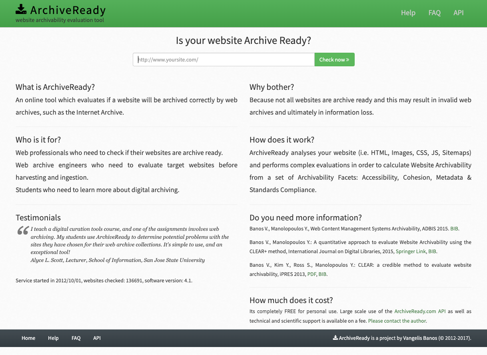
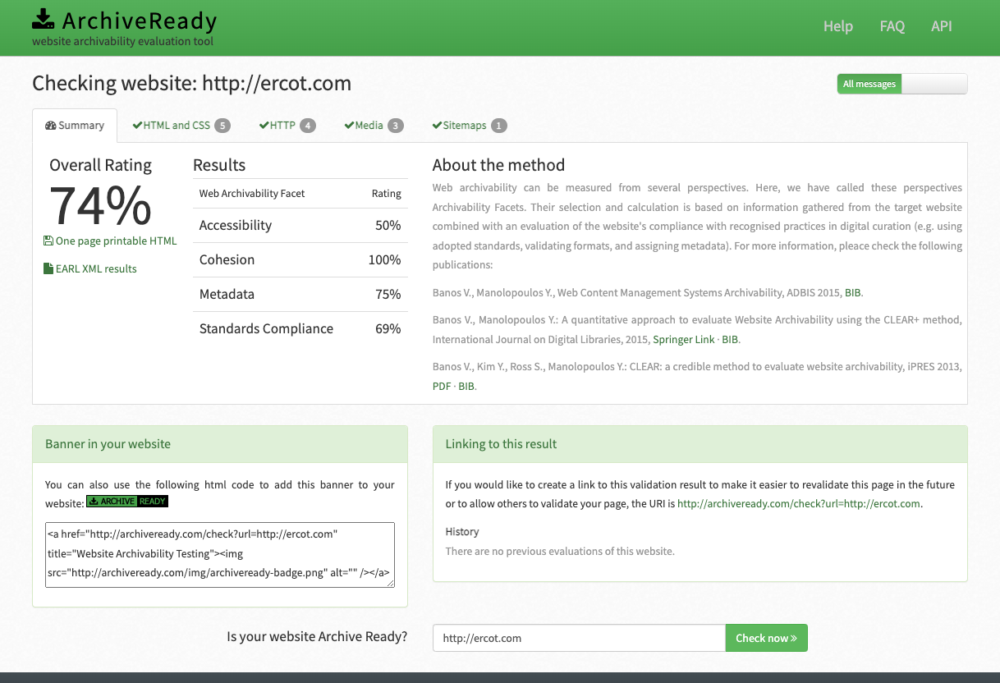
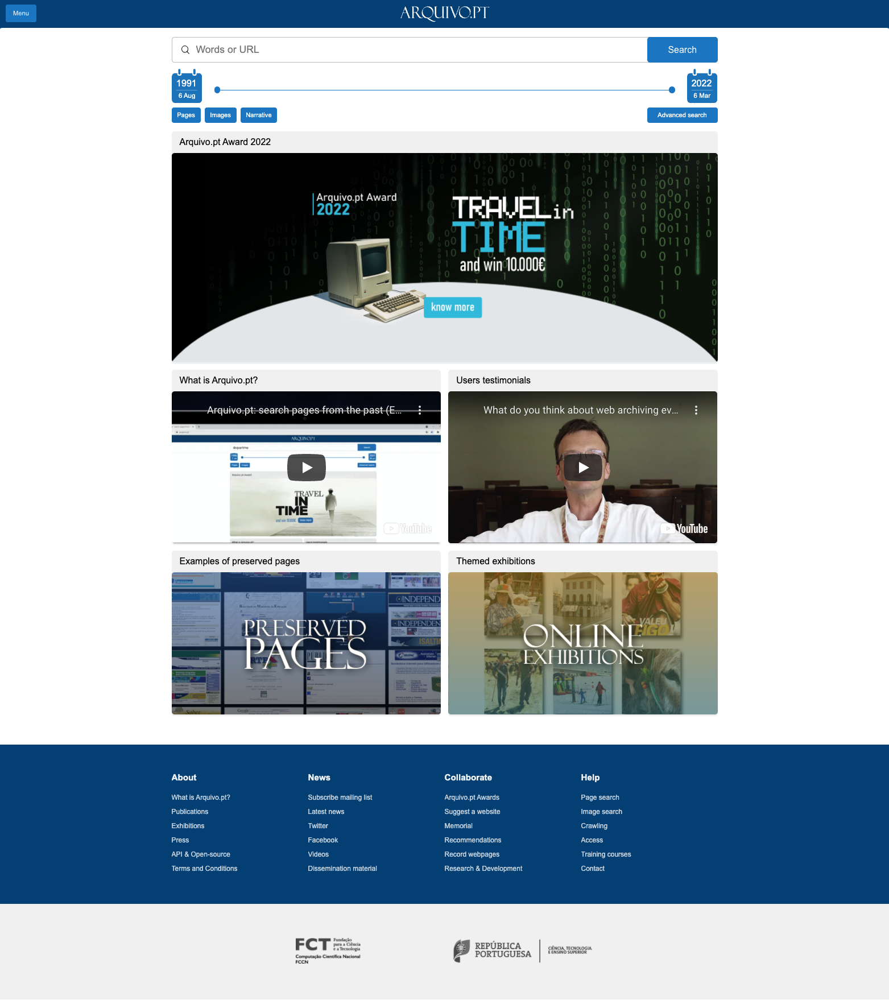

# Module Eight - Other Tools

## Overview and Objectives

### Overview:
The purpose of this module is to provide an overview of a number of tools for curation, characterization or profiling (to analyze and understand the captured content) and tools to widen access to collections and raise awareness for web archives.

This will build on concepts that you were introduced to in the previous technology modules. 

There are several readings, some online documentation to skim, and several power points that you will review. 

### Objectives:
1. Learn about additional tools in the web archiving landscape.
2. Become familiar with some of the standards in development for enabling cross-archive access (Memento).
3. Experiment with ArchiveReady and familiarize yourself with the concept of archivability.

## Readings

### General

The readings in this module are chosen to give you some exposure to different tools and systems that are being used around the world for different aspects of the web archive lifecycle. 

* International Internet Preservation Consortium (2020). Session 3D: Main Concepts and Technologies: Other Tools 
  *  Slides - https://netpreserve.org/download/iipc-training-session-beginners-3d-slides/  
  *  Speaker Notes - https://netpreserve.org/download/iipc-training-session-beginners-3d-notes/  
  *  Review these slides and speaker notes.  I suggest reading the notes when you have the slides open in another part of the screen. 

### Memento

* Jones S.M., Klein M., Sompel H.V.., Nelson M.L., Weigle M.C. (2021) Interoperability for Accessing Versions of Web Resources with the Memento Protocol. In: Gomes D., Demidova E., Winters J., Risse T. (eds) The Past Web. Springer, Cham. https://doi.org/10.1007/978-3-030-63291-5_9  
  * Direct Link to UNT Libraries Access - https://link-springer-com.libproxy.library.unt.edu/chapter/10.1007/978-3-030-63291-5_9  
* Web Archiving Fundamentals pt 2: Memento https://video.vt.edu/media/Web+Archiving+Fundamentals+pt+2A+Memento/1_5gvqowto  
  * This is probably the best overview of what Memento actually is and how it can be used to improve access to web archives.  
* Memento Guide - Introduction to Memento - http://www.mementoweb.org/guide/quick-intro/  
* About the Memento Project - http://mementoweb.org/about/  
* Memento Project - https://en.wikipedia.org/wiki/Memento_Project  
* Memento, About the Time Travel Service - http://timetravel.mementoweb.org/about/  
* Memento at the W3C - https://www.w3.org/blog/2016/08/memento-at-the-w3c/  
* Coalition for Networked Information (2010). CNI: Memento: Time Travel for the Web -
https://www.youtube.com/watch?v=ePBMn-_I1rU 
   * I don't expect you to watch this whole video, but it is a very good, and deep dive into Memento.

### Webrecorder/Conifer

Webrecorder (service is now called Conifer)

* Conifer. (2019). Introduction to Webrecorder.io - getting started https://www.youtube.com/watch?v=yX2RrfNPQjg 
* Rhizome. (2020). Webrecorder.io is now Conifer.rhizome.org. https://blog.conifer.rhizome.org/2020/06/11/webrecorder-conifer.html  
* Frequently Asked Questions - https://conifer.rhizome.org/_faq  
* Conifer Guide - https://guide.conifer.rhizome.org/  

### Archives Unleashed

* Ruest, N., Lin, J., Milligan, I., & Fritz, S. (2020). The Archives Unleashed Project: Technology, Process, and Community to Improve Scholarly Access to Web Archives. Proceedings of the ACM/IEEE Joint Conference on Digital Libraries in 2020. Association for Computing Machinery, New York, NY, USA, 157–166. https://doi.org/10.1145/3383583.3398513  
  * UNT Libraries Access Link - https://dl-acm-org.libproxy.library.unt.edu/doi/pdf/10.1145/3383583.3398513 
* Archives Unleashed Overview - https://www.youtube.com/watch?v=nBwgM63MxY8 
* Project Website - https://archivesunleashed.org/  
* The Archives Unleashed Toolkit - https://archivesunleashed.org/aut/

### Seed Nomination Services
* URL Nomination Tool - https://digital2.library.unt.edu/nomination/ 
* URL Nomination Tool Code (django-nomination) - https://github.com/unt-libraries/django-nomination 
* URL Nomination Tool Presentation - https://digital.library.unt.edu/ark:/67531/metadc287023/m2/ 
* Cobweb Service - https://cdlib.org/services/pad/webarchiving/cobweb/  
* Cobweb Code - https://github.com/CobwebOrg/cobweb  

### Other Crawling Services / Software Suites
* Web Curator Tool - https://webcuratortool.org/ 
* Web Curator Tool Code - https://github.com/DIA-NZ/webcurator/wiki 
* Web Curator Tool Documentation - http://webcurator.sourceforge.net/ 
* Netarchive Suite - https://sbforge.org/display/NAS/NetarchiveSuite  
* Netarchive Suite Github - https://github.com/netarchivesuite  

## Archiving Exercise

### Web Archiving Exercise - Archivability with ArchiveReady
This week we will look at the concept of archivability as it pertains to Web Archives. 

First, take a look at this paper by Banos, Kim, Ross and Manolopoulos. 

Banos V., Kim Y., Ross S., Manolopoulos Y.: CLEAR: a credible method to evaluate website archivability, iPRES 2013, http://purl.pt/24107/1/iPres2013_PDF/CLEAR%20a%20credible%20method%20to%20evaluate%20website%20archivability.pdf  

You don't need to read the article in depth, but it is helpful to get the context of the work. 

Next, navigate to http://archiveready.com  (sadly it is not an https service). 

Get familiar with this service by browsing around the website.  

After you have looked around, choose the homepage of an organization or other website you want to test. 

Enter the websites URL into the provided box and choose "Check now". 

For this example I chose to look at the Electric Reliability Council of Texas (ERCOT) website (https://ercot.com ). 

Look at the different results tabs to get an idea of the different metrics and archivability facets. 

In this week's discussion you will share the website you chose for this exercise. Additionally, you will share the Overall ratings as well as a synthesis of the findings from the service. Any additional observations you find interesting about this service would be good to share as well.  Finally, explain how you think this kind of service could be helpful in the web archiving lifecycle. 

### Additional Readings about Archivability
* Web Archivability Community Group - https://www.w3.org/community/webarchivability/ 
* Archivability - https://library.stanford.edu/projects/web-archiving/archivability  
* Banos V., Manolopoulos Y.: A quantitative approach to evaluate Website Archivability using the CLEAR+ method, International Journal on Digital Libraries, 2015, https://doi.org/10.1007/s00799-015-0144-4  
  * UNT Direct Link - https://www-proquest-com.libproxy.library.unt.edu/docview/1785958458?pq-origsite=summon  

## Exploring Web Archives

Each week we will try and learn about a new web archive, a web archiving tool, or a web archiving service.  The goal of this is to get an introduction to what is happening in the web archiving space, what is being collected, and who is collecting it. 

This week we will look at the Portugal National Web Archive (https://arquivo.pt/?l=en )

What is Arquivo.pt - https://sobre.arquivo.pt/en/help/what-is-arquivo-pt/  

Examples of preserved pages - https://sobre.arquivo.pt/en/examples/examples/ 

Exhibitions - https://sobre.arquivo.pt/en/examples/collections/ 

Youtube Channel for Arquivo.pt - https://www.youtube.com/channel/UCEMJX0ICk1t2TzuNXghxKDg  

Some things that I would like for you to notice is the different ways of presenting web archives.  The style of the wayback interface that they are presenting is different than others we have seen so far in this course. A description of the differences would be useful in your discussion post. The service also presents some examples and exhibits to help users get into the web archives a little better.  How well does this work in your opinion? What did you end up exploring in the archive? How well does arquivo.pt present content in Portuguese and English.  Have you seen other interfaces in multiple languages in our web archive exploration so far?

It should be of no surprise that the web archive focusing on the .pt domain and the national web of Portugal might not have the same content we are used to seeing here in the United States.  If you have trouble thinking about what to look at in the archive consider finding the url of a city in Portugal, a local sports team or other cultural event in Portugal and exploring what has been archived

## Discussion

### Discussion Post:
In at least one paragraph, discuss what you learned this week about other tools and service in the web archive landscape. What were some of the terms or concepts that were new to you this week? What are some things that still need clarity for you? How do you think a protocol Memento and its associated technologies can benefit the web archive landscape?

In at least one paragraph, describe what happened when you used the ArchiveReady service service. What was the website you chose for this exercise? What was the Overall rating that this website received? Discuss the findings from the service in addition to this overall score. Any additional observations you find interesting about this service would be good to share as well.  Finally, explain how you think this kind of service could be helpful in the web archiving lifecycle. 

Finally, in at least two paragraphs, discuss the Portugal National Web Archive arquivo.pt and what you learned about this web archive.  What are some differences you noticed in the presentation of web archives in this service compared to collections we have looked at in previous weeks. Share your observations of the examples and the exhibitions and share your opinions about if that helped in exploring the collection.  Finally what are some of the websites that you explored in arquivo.pt?

### Class Engagement:
After you have made the discussion post described above, take the time to response, comment, or engage with at least **two** of your classmates posts.  

If there are any unanswered questions feel free to try and offer an answer or suggestion to the original poster.  Did they mention something that made you investigate something further? If so, what was it? 

Search entries or author
