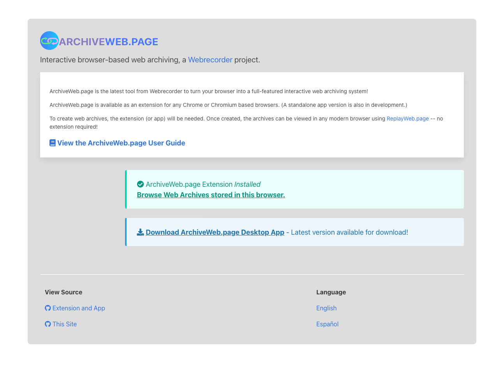
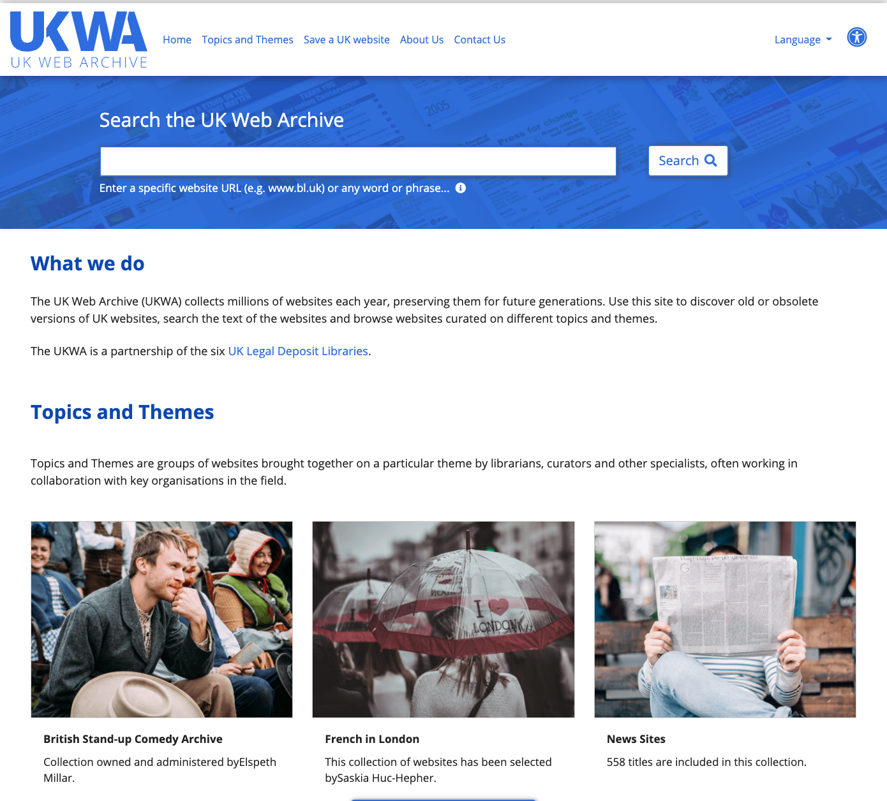

# Module Nine - Collection Policies

## Overview and Objectives

### Overview:

The purpose of this module is to show how collection policies, collection scopes, and general selection activities occur in the scope of building a web archive. Web archiving is at its lowest level another tool for building collections in libraries and archives.  In order to communicate the scope of these collections with others some sort of collection scope or policy statement can be useful. 

This will build on concepts that you were introduced to in the technology modules and start to align them with other concepts in the library and archives space. 

There are several readings, some online documentation to skim, and several power points that you will review. 

### Objectives:
1. Familiarize yourself with different web archive collection policies.
2. Understand the role that web archives can play in the collecting and acquisition of materials in libraries and archives.
3. Install and use the ArchiveWeb.page tool for creating web collections locally.

## Readings

### General

The readings this week were selected to give you an introduction to the collection development approaches that are common to building collections using web archiving tools and techniques.  These readings are a combination of both theory and practice in this space. You will be introduced to the framework we will use for the next major assignment in the Murray & Hsieh piece. 

* International Internet Preservation Consortium (2020). _Session 7: Writing a Web Archiving Policy_ 
  * Slides - https://netpreserve.org/download/iipc-training-session-beginners-7-slides/ 
  * Speaker Notes - https://netpreserve.org/download/iipc-training-session-beginners-7-notes/ 
  * Review these slides and speaker notes.  I suggest reading the notes when you have the slides open in another part of the screen. 
* International Internet Preservation Consortium (2020). _IIPC Training Video Case Study, Topic 5: Web Archiving Collecting Policies_
https://www.youtube.com/watch?v=-NxJXrUTJ8A
* Post, C. (2017). Building a Living, Breathing Archie: A Review of Appraisal Theories and Approaches for Web Archives. Preservation, Digital Technology & Culture 46(2). 69-77. https://doi.org/10.1515/pdtc-2016-0031 
  * UNT Libraries Direct Link - https://libproxy.library.unt.edu/login?url=https://www.proquest.com/docview/1940603266 
  * Free online version - http://libres.uncg.edu/ir/uncg/f/C_Post_Building_2017.pdf 
* Summers, E. & Punzalan, R. (2017). Bots, Seeds and People: Web archives as infrastructure. Proceedings of the 2017 ACM Conference on Computer Supported Cooperative Work and Social Computing. 821-834. https://doi.org/10.1145/2998181.2998345
  * UNT Libraries Direct Link - https://dl-acm-org.libproxy.library.unt.edu/doi/10.1145/2998181.2998345 
  * Free arXiv Version - https://arxiv.org/abs/1611.02493 (pdf: https://arxiv.org/pdf/1611.02493.pdf) 
  * Read Crawl Modalities in Findings p. 825-826 (or p 5-6 in the preprint)
* Ward, E. (2018). Archiving the Web @EBRPL: Creating and following a web collecting policy in a public library. https://archive-it.org/blog/post/archiving-the-web-ebrpl-creating-and-following-a-web-collecting-policy-in-a-public-library/ 
* Murray, K. & Hsieh, I. (2006). Collection Planning Guidelines https://digital.library.unt.edu/ark:/67531/metadc33006/ 
  * https://digital.library.unt.edu/ark:/67531/metadc33006/m2/1/high_res_d/cpg_final_31may2006.pdf 
  * Page 18-40 will come back in the next major assignment. 

### Web Archive Collection/Collecting Policies

A selection of policies for web archive collections at different institutions around the US.  This is only a sample of those that are easily identifiable. You should notice the scope and breadth of the different plans. In this weeks' discussion you will select one of these to describe, or ideally, find a policy from another institution not listed here for the discussion. 

* Columbia University Libraries - https://library.columbia.edu/collections/web-archives/policies.html 
* J. Paul Getty Trust - https://archives.getty.edu/getty_images/digitalresources/PublicWebArchivesCollectingPolicy.pdf 
* Montana State University - Web Archives Policies and Procedures - https://lib.utsa.edu/specialcollections/sites/specialcollections/files/2020-09/WebArchives_Policy_2020-08-20.pdf 
* NCSU Web Archiving - https://ncsu-libraries.github.io/web-archiving-docs/
* Purdue University - https://www.lib.purdue.edu/sites/default/files/spcol/purdue-archives-web-archiving-policy.pdf 
* Stanford University Library - https://library.stanford.edu/projects/web-archiving/collection-development 
* University of California San Francisco - https://www.library.ucsf.edu/archives/ucsf/web/policy/ 
* University of Chicago Web Archive Collection - https://www.lib.uchicago.edu/e/scrc/findingaids/view.php?eadid=ICU.SPCL.UCWEB 
* UT San Antonio Web Archives Policy - https://lib.utsa.edu/specialcollections/sites/specialcollections/files/2020-09/WebArchives_Policy_2020-08-20.pdf 
* Virginia Memory - https://www.virginiamemory.com/collections/web_archives/guidelines 

International Internet Preservation Consortium - Collection Development Policies - https://netpreserve.org/web-archiving/collection-development-policies/ 

## Archiving Exercise

### Archiveweb.page

This exercise can be accomplished by either installing a free extension via the Chrome Web Store (https://chrome.google.com/webstore/) or installing a desktop version of the Archiveweb.page application. This tool will enable you to start creating web archives locally of websites and have access to these collections.  Because this involves actually installing something locally it might be a bit more involved than previous exercises.

Here is a video that gives an overview of why this tool exists -
https://www.youtube.com/watch?v=hPcwDoDfhmo
 

The easiest way to work with this tool is with a modern version of the Chrome (https://www.google.com/chrome/)  browser.  If you don't have the ability to install the Chrome browser there are options for downloading a desktop version of Archiveweb.page. 

Next navigate to https://archiveweb.page/

This video by Ilya Kreymer gives a nice overview of the process. - 
https://www.youtube.com/watch?v=AP6wucoqJw0&t=1067s

You can also look at the provided guide - https://archiveweb.page/guide 

### Activity

The goal of this exercise is to experiment with this tool and try and archive some web content on your own computer.  This tool contains both the capture and playback pieces in the web archive workflow. It is an interactive tool that records the things that you browse in a Chrome tab and even has some capabilities to automatically capture some content using its "Autopilot" feature. 

Try recording a website you are familiar with. I would suggest picking an organization, governmental or other website and keeping clear of the social media sites as you start.  It makes it a bit easier to see how things are getting captured. If you like you can go back and try capturing social media sites as well, just not the best to begin with. Try creating a collection, capturing some content, and then try and download that content to your local machine.  

In the discussion this week you will report on your success with this tool and share information about what website you captured and how well the tool worked.  Were you able to download the web archive to your local machine? What did you think about this experience compared to others.  What are your observations about how this is similar or different compared to the other hosted web archiving tools you have used in previous exercises?

## Exploreing Web Archives

Each week we will try and learn about a new web archive, a web archiving tool, or a web archiving service.  The goal of this is to get an introduction to what is happening in the web archiving space, what is being collected, and who is collecting it. 

This week we will look at the UK Web Archive. 

Start by navigating over to the UK Web Archive - https://www.webarchive.org.uk/ 

UK Web Archive: About us - https://www.webarchive.org.uk/en/ukwa/about 

Topics and Themes - https://www.webarchive.org.uk/en/ukwa/collection

UK Web Archive: Github repositories - https://github.com/ukwa/ 

The UK Web Archive, like arquivo.pt from last week is a web archive focused primarily around a national domain.

The UK Web Archive in this case is focused on the countries that are included in the United Kingdom. 

One of the things you should try is to explore the different topics and themes to get a better idea of the websites that are included.

Another feature about this web archive that you should try is the word or phrase searching. 

Many of you have noted that search would be nice in other discussions in this course and again like arquivo.pt we are starting to see search as another way of accessing content in web archives. 

## Discussion

### Discussion Post:
In at least one paragraph, discuss what you learned this week about collection policies for web archives. How familiar were you with collection description or scope statements in the past? What is the value of having collection policies for web archives? 

In the Summers and Punzalan (2017) article, they describe different modalities for crawling and include domain, website, topical, event based, and document crawls. In at least one paragraph select one of these modalities, describe it in your own terms and give an example of a type of web archive collection that could fit this modality.  The example could be from your previous explorations in class or can be an example of a web archive collection that could be created. 

In one paragraph describe what you found in a web archive collection policy. You can choose one from this week's readings or if you want a virtual fist bump from me when I grade, find an example of a policy or collection scope that isn't listed in the readings.  Some examples of things you might comment on are the audience of the document, the structure, how detailed or broad it was written, or any other things you noticed when looking at it.  How does the document you identified assist in the web archiving process?

In at least one paragraph, describe what happened when you used the ArchiveWeb.page tool.  Did you have any challenges getting it installed and working? What sites did you try and capture? How well did they work for you? Were you able to download the resulting archive file? What kind of file downloaded? What did you think about this experience compared to others.  What are your observations about how this is similar or different compared to the other hosted web archiving tools you have used in previous exercises?

Finally, in at least two paragraphs, discuss the UK Web Archive (UKWA) and what you learned about this web archive.  What are some differences you noticed in the presentation of web archives in this service compared to collections we have looked at in previous weeks. Share your observations of the topics and themes feature and share your opinions about if that helped in exploring the collection.  Finally what are some of the websites that you explored in the UKWA?

### Class Engagement:
After you have made the discussion post described above, take the time to response, comment, or engage with at least **two** of your classmates posts.  

If there are any unanswered questions feel free to try and offer an answer or suggestion to the original poster.  Did they mention something that made you investigate something further? If so, what was it? 

