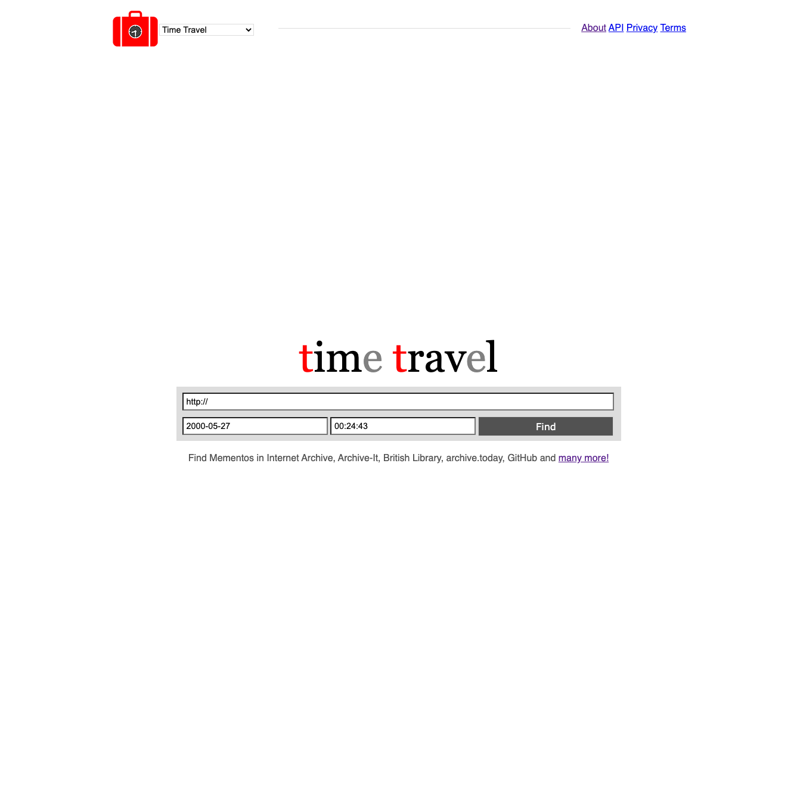
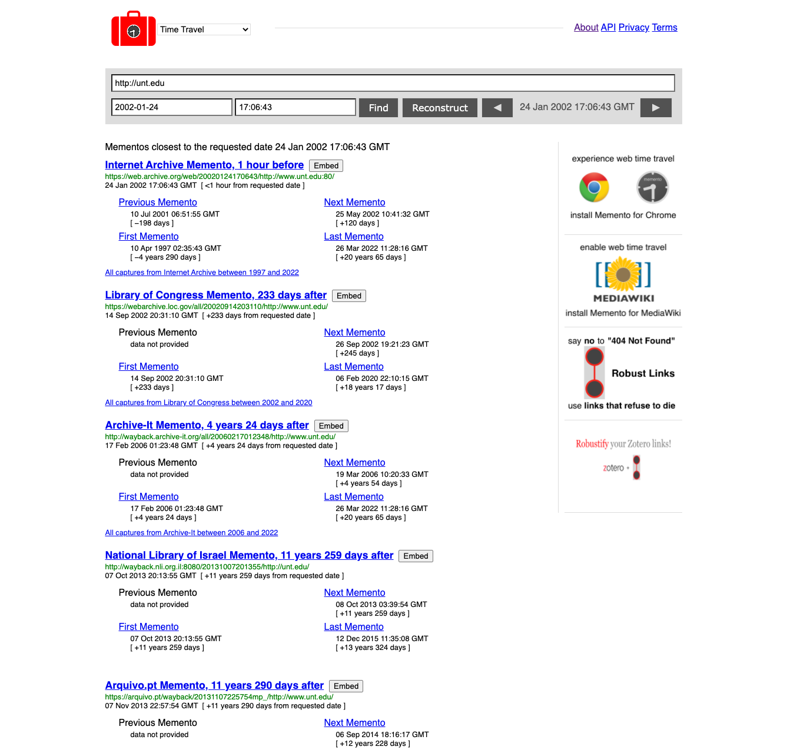
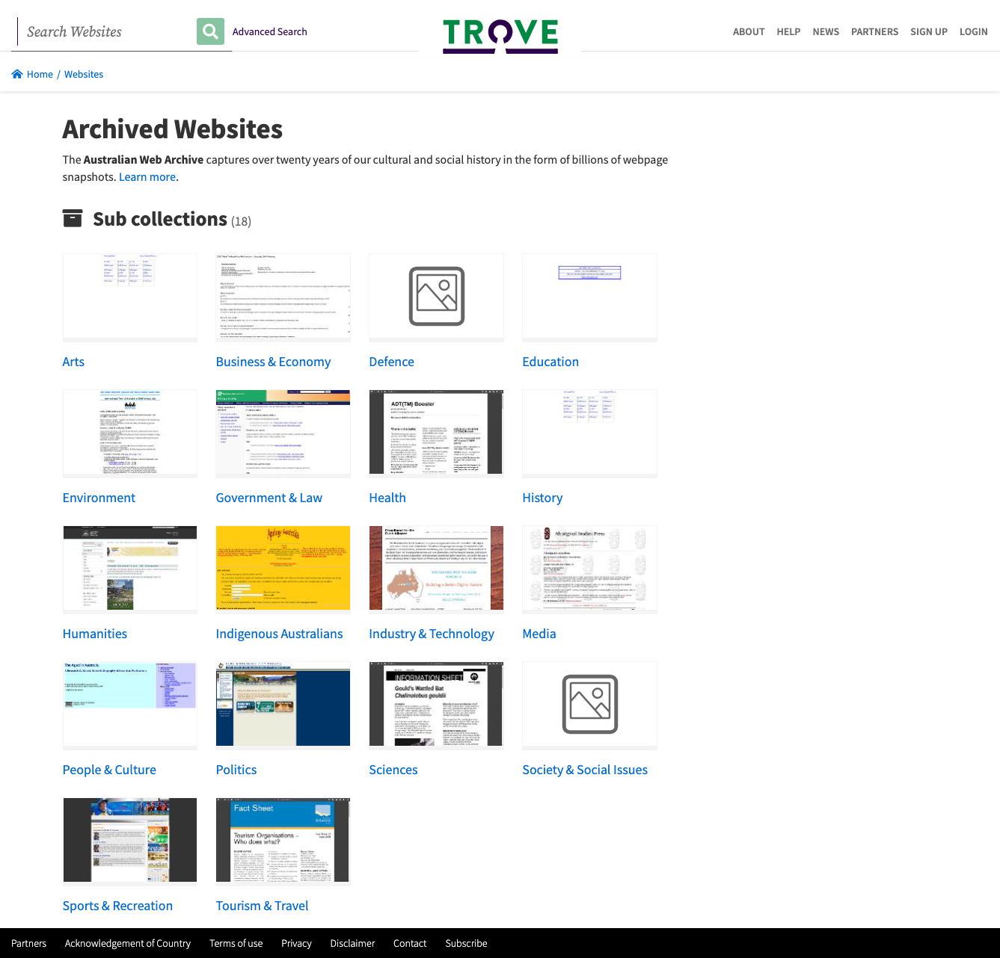
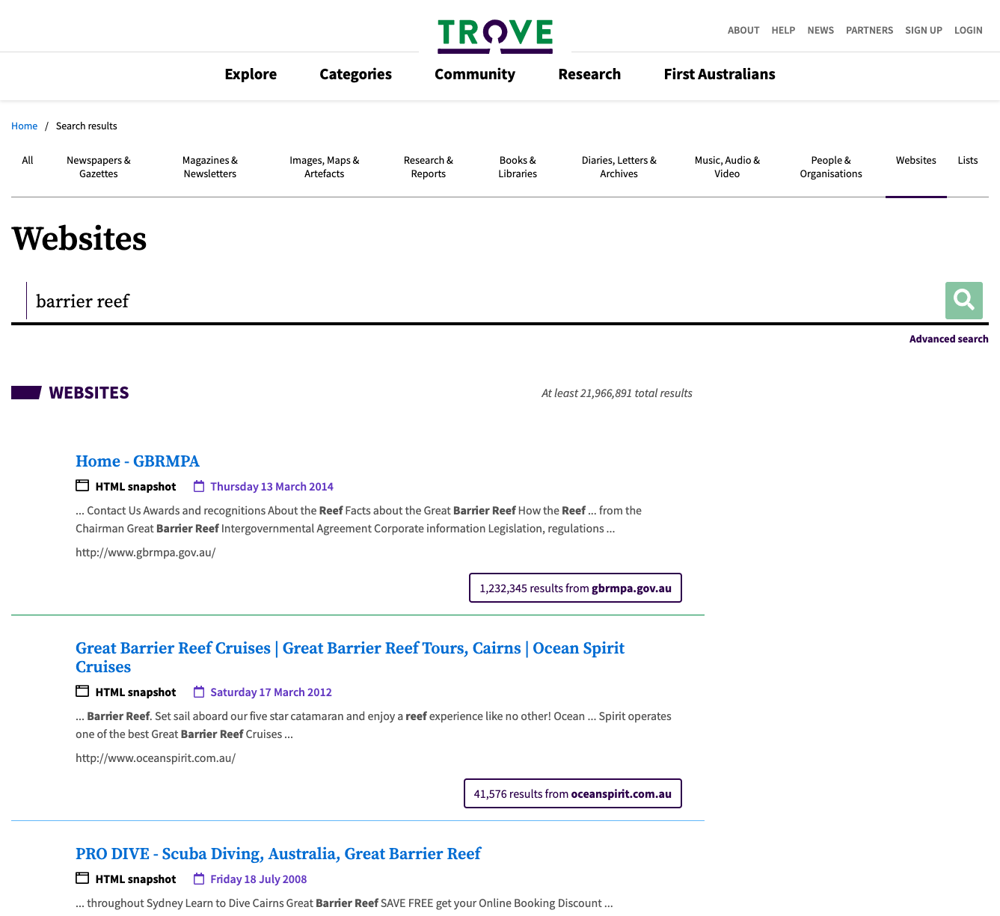
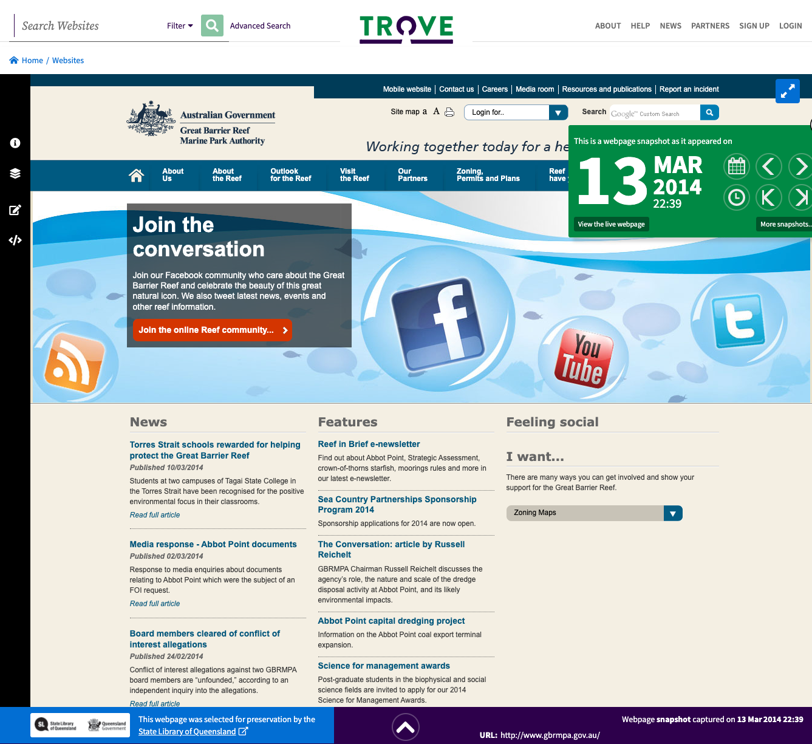

# Module Ten - Metadata

## Overview and Objectives

### Overview:

The purpose of this module is to explore the use of metadata to describe web archives.  Metadata is used to provide description and navigational aides to many types of digital collections. Web archives are one of those types of digital resources that benefit from metadata.  Metadata can be applied at different levels within a web archive itself and this module will discuss different approaches to metadata use in web archives.

This will build on concepts discussed in the collection policies module and will be important in the final project for this course.

There are several readings, some online documentation to skim, and several power points that you will review. 

### Objectives:

1. Familiarize yourself with different approaches in applying metadata to web archive.
2. Become familiar with Dublin Core metadata as it applies to web archives.
3. Explore the Memento Time Travel Service for accessing multiple web archives in a single interfaces.

## Readings

### General 

The readings this week were selected to give you an introduction to different approaches for applying metadata to web archives.  There is a wide range of options for metadata and web archives and depending on the scope, size, and organization of your web archiving program, one or more approaches might be in place. 

* Bragg, M., & Hanna, K. (2013).  The Web Archiving Life Cycle Model. http://ait.blog.archive.org/files/2014/04/archiveit_life_cycle_model.pdf
    * pp. 20-21 (Metadata and Description)
* Dooley, J., Farrell, K., Kim, T., & Venlet, J. (2017). Developing Web Archiving Metadata Best Practices to Meet User
Needs. Journal of Western Archives. 8(2).  https://doi.org/10.26077/cffd-294a 

### OCLC Web Archive Metadata

* Dooley J. (2016). Slam bam WAM: Wrangling best practices for web archiving metadata - https://hangingtogether.org/slam-bam-wam-wrangling-best-practices-for-web-archiving-metadata/
* Dooley, J. & Bowers, K. (2018). Descriptive Metadata for Web Archiving. OCLC Research https://www.oclc.org/research/publications/2018/oclcresearch-descriptive-metadata.html 
    * Skim this publication. 
* Web Archiving Metadata Working Group - OCLC Research - https://www.oclc.org/research/areas/research-collections/wam.html
Project website.
* OCLC Research (2018). Outcomes from the OCLC Research Library Partnership Web Archiving Metadata Working Group
https://www.youtube.com/watch?v=xTR8RK3t2jU
    * A nice overview of the work. 

### Other Metadata Resources

* UNC University Archives (2013). University of North Carolina at Chapel Hill University Archives Collected Websites, 2012-2021 https://finding-aids.lib.unc.edu/40417/ 
* New York Art Resources Consortium (2018). Metadata Application Profile for Description of Websites with Archived Versions Version 2. https://web.archive.org/web/20200702210617/https://www.nyarc.org/sites/default/files/web-archiving-profile-version2.pdf 
    * Skim this publication.
* Archive-It. (2021). Add, edit, and manage your metadata https://support.archive-it.org/hc/en-us/articles/208332603-Add-edit-and-manage-your-metadata
* Venlet, J. (2018). Behind the Scenes: Describing Archived Websites - https://blogs.lib.unc.edu/uarms/2018/05/23/describing-archived-websites/ 
* Formenton, D. & Gracioso, L. (2022). Metadata standards in web archiving technological resources for ensuring the digital preservation of archived websites. RDBCI: Digital Journal of Library and Information Science, 20 https://doi.org/10.20396/rdbci.v20i00.8666263 

## Archiving Exercise

### Web Archiving Exercise - Time Travel with Memento

This week we will look in depth at the Time Travel service that helps discover Mementos from different web archiving programs around the world. 

We learned about Memento in Module Eight - Other Tools so if you would like to review the Memento Protocol or the specifics of TimeGates and TimeMaps that is a good place to start. Here is a quick overview of the different components for your review http://www.mementoweb.org/guide/quick-intro/ 

The Time Travel Service is an easy way to see what these protocol and infrastructure components can enable once they have been implemented. 

First, navigate to http://timetravel.mementoweb.org/

You can learn more about the service by navigating to the about page - http://timetravel.mementoweb.org/about/

You can then insert a URL you want to look at and the date and time you are interested in viewing.  I've decided to look at https://unt.edu back in January of 2002.  http://timetravel.mementoweb.org/list/20020124170643/http://unt.edu

You can see the different web archives that have Mementos nearest to the time I am interested in looking at.  Additionally it will tell you how far from the requested date the Memento that they have is.  So in this example, the closest example is from 1 hour before my requested time of 5:06:43 PM on January 1, 2002.  

Try out some different URLs and times in the service.  What were the archives that you saw the most in the results? What was the closest to your requested time that you saw? What was the furthest away? For example in my example the furthest away Memento for the example above was 11 years 290 days after the requested time in Arquivo.pt.  Explore some of the different web archive instances that are listed and see if you notice the differences in the Mementos. Why is a service like this useful? What are some situations where having greater control for knowing when a web archiving is providing harvested content comes into play. 

This week's discussion you will be reporting out on your experiments with this tool. 

## Exploring Web Archives

### Trove - Australian Web Archive

Each week we will try and learn about a new web archive, a web archiving tool, or a web archiving service.  The goal of this is to get an introduction to what is happening in the web archiving space, what is being collected, and who is collecting it. 

This week we will look at the Trove archive in Australia. 

Trove is an aggregation platform for libraries, universities, museums, and galleries across Australia. Trove is maintained by the National Library of Australia. 

https://webarchive.nla.gov.au/collection

https://trove.nla.gov.au/help/categories/websites-category

There are two ways of interacting with Trove and its web archive.  First is using the Sub Collections listed on the main page.  You can browse down into sub collections and locate examples of websites held in the collection. 

Another option is to use the search feature in the top left side of the page.  I did a quick search for a broad search for 'barrier reef' https://trove.nla.gov.au/search/category/websites?keyword=barrier%20reef 

Picking the first example gives me this displayed page. https://webarchive.nla.gov.au/awa/20140313113916/http://www.gbrmpa.gov.au/

Take some time to explore this web archive and the different ways it presents information.  In this week's discussion you will talk about some of the things that you find as well as giving your observation on the interface and the different ways it presents information from other web archives that we have seen so far in class.

## Discussion 

### Discussion Post:
In at least one paragraph, discuss what you learned this week about metadata for web archives. How familiar were you generally with metadata before this week? What are some of the concepts that were new to you in relation to metadata? Discuss some of the different "levels" that metadata can describe in a web archive such as a seed, site, collection, or document.

In one paragraph give a short sales pitch for the tool or service that you described in the Web Archive Tool Critique assignment from a few weeks ago. Give an overview of the tool, what it is trying to accomplish, and anything you would recommend to your fellow students about the tool.

In at least one paragraph, describe what happened when you used the Time Travel Service from the Memento team.  What were the archives that you saw the most in the results? What was the closest to your requested time that you saw? What was the furthest away? Why is a service like this useful? What are some situations where having greater control for knowing when a web archiving is providing harvested content comes into play. Any other thoughts or observations about this tool would be great to mention.

Finally, in at least two paragraphs, discuss the Trove system and the Australian Web Archive. What are some differences you noticed in the presentation of web archives in this service compared to collections we have looked at in previous weeks. Share your observations of the topics and themes feature and share your opinions about if that helped in exploring the collection.  Finally what are some of the websites that you explored in Trove? How well did you find the search function worked?

### Class Engagement:

After you have made the discussion post described above, take the time to response, comment, or engage with at least **two** of your classmates posts.  

If there are any unanswered questions feel free to try and offer an answer or suggestion to the original poster.  Did they mention something that made you investigate something further? If so, what was it? 
