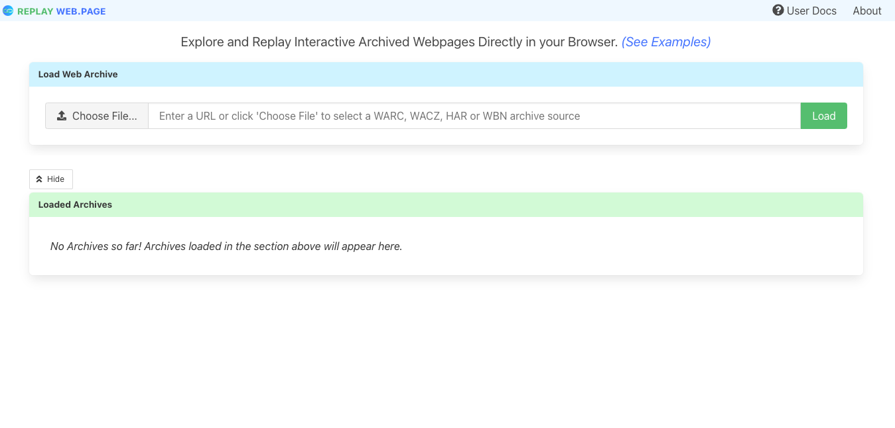
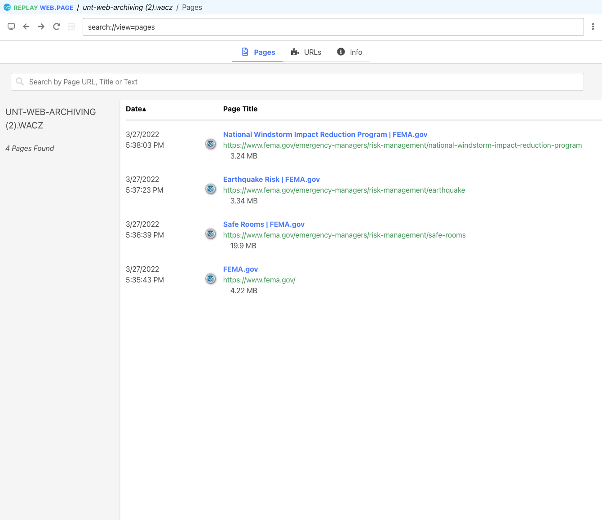
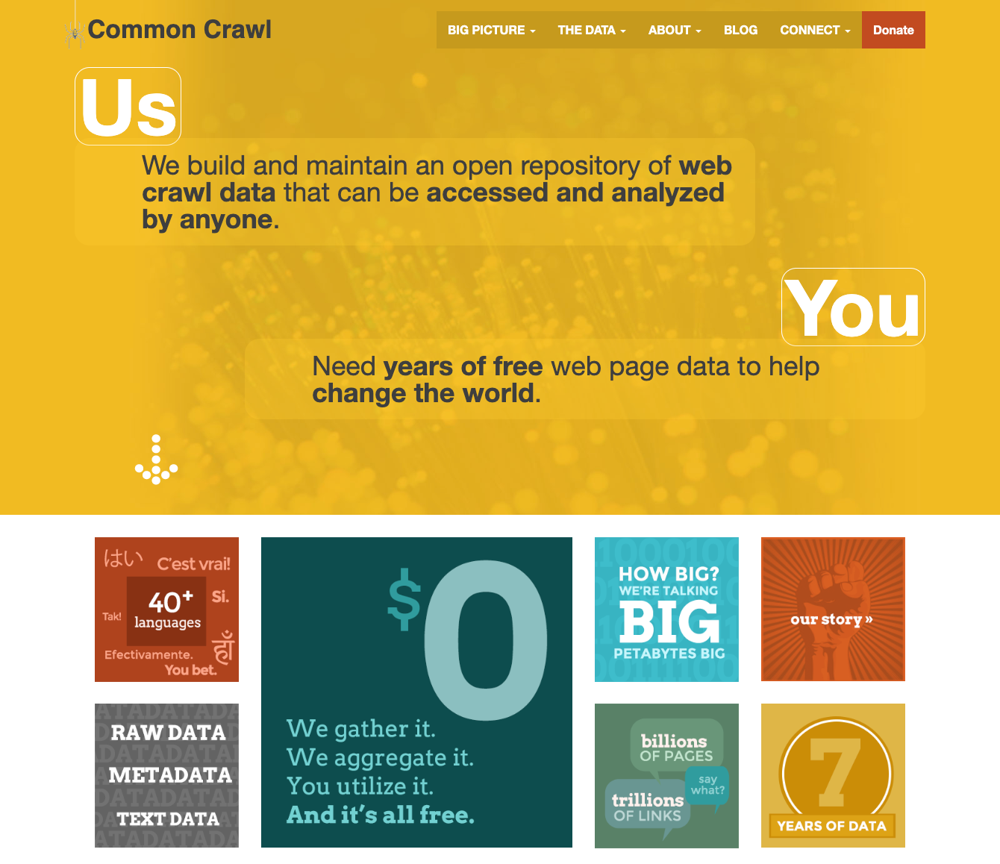

# Module Eleven - Quality Assurance

## Overview and Objectives

### Overview:
The purpose of this module is to explore quality assessment in web archives. As we have seen so far in our course, there are many times when the replay of content does not match the original site. This can be caused by many situations. Was the content within scope to be crawled? Was there an issue extracting the URL for the content? Was there issues harvesting the content? Are the issues related to playback? Is the content in the web archive but unavailable because of a long chain of redirects like we see with Youtube content? There are many reasons that quality can not meet expectations in a web archive and this module is going to give you an introduction to the main concepts.

This will build on concepts discussed in the Module Nine - Collection Policies, and Module Ten - Metadata modules and will be important in the final project for this course.

There are several readings, some online documentation to skim, and several power points that you will review. 

### Objectives:
1. Familiarize yourself with quality assessment in web archive.
2. Identify common issues found in web archives and their playback.
3. Explore the use of the ReplayWeb.page service.

## Readings

The readings this week were selected to give you an introduction to quality assessment in web archives.  This module will introduce common problems that can occur in the web archiving space related to quality control and approaches that can be used to combat these problems. 

### Overview of the Challenges
* Brown, A. (2006). Archiving websites: A practical guide for information management professionals.
  * Chapter 5, Quality assurance and cataloging. 69-81
  * Click on the title of this link - https://scholar.google.com/citations?view_op=view_citation&hl=en&user=gZuRr94AAAAJ&citation_for_view=gZuRr94AAAAJ:Se3iqnhoufwC I was able to get to the 5th chapter via Google Books if I went through this URL. Let me know if this doesn't work for you. 
  * Available at the Discovery Park Library - https://discover.library.unt.edu/catalog/b3062630
  * Please do not attempt to purchase this Chapter. I can work with you to get access  Download access. It is a good resource but kind of a pain to get access to. 
* Bragg, M., & Hanna, K. (2013).  The Web Archiving Life Cycle Model. http://ait.blog.archive.org/files/2014/04/archiveit_life_cycle_model.pdf
  * pp. 26-27 (Quality Assurance and Analysis)
* Reyes, B., Phillips, M. E., & Ko, L. (2014). Current Quality Assurance Practices in Web Archiving. https://digital.library.unt.edu/ark:/67531/metadc333026/ 
* Reyes, B., McDevitt, J., Sun, J., & Liu, X. (2020). Quality Matters: A New Approach for Detecting Quality Problems in Web Archives. Proceedings of the Annual Conference of CAIS. https://doi.org/10.29173/cais1145

### Blog Posts
* Not All Websites Are Made Equal (Or Friendly): Archiving ephemeral art content on the web - https://archive-it.org/blog/post/not-all-websites-are-made-equal-or-friendly-archiving-ephemeral-art-content-on-the-web/
* Hockx-Yu, H. (2012). How good is good enough? - Quality Assurance of harvested web resources. https://britishlibrary.typepad.co.uk/webarchive/2012/10/how-good-is-good-enough-quality-assurance-of-harvested-web-resources.html 
* UK Web Archive blog. (2017). The Challenges of Web Archiving Social Media - http://blogs.bl.uk/webarchive/2017/04/the-challenges-of-web-archiving-social-media.html 

### Other Reading 
* Reyes, B. (2018). A Grounded Theory of Information Quality in Web Archives. 
  * Dissertation - https://digital.library.unt.edu/ark:/67531/metadc1248497/
  * Defense Slide - https://digital.library.unt.edu/ark:/67531/metadc1181153/ 
* Archive-It (n.d.) Scoping crawls for specific types of sites. https://support.archive-it.org/hc/en-us/sections/201841373-Scoping-crawls-for-specific-types-of-sites
* Archive-It (n.d.) Quality Assurance Overview. https://support.archive-it.org/hc/en-us/articles/208333833-Quality-Assurance-Overview 
* Library of Congress (n.d.) Creating Preservable Websites. https://www.loc.gov/programs/web-archiving/for-site-owners/creating-preservable-websites/ 
* Marill, J., Boyko, A., Ashenfelder, M., & Jones, G. (2004). Web Harvesting Survey. https://digital.library.unt.edu/ark:/67531/metadc1457765/ 

## Archiving Exercise

### Web Archiving Exercise - ReplayWeb.page

This week we are going to be looking at one of the tools in the suite of tools being developed by the Webrecord.org group. 

This exercise will build on the work that you did in Module Nine - Archiving Exercise where you looked at the ArchiveWeb.page service. 

The ReplayWeb service is designed to give you access to the contents in common web archive files directly in your browser. 

Start by navigating to https://replayweb.page/

What you will do is load a warc or wacz file into this service and investigate the contents of that web archive container file. 

You can visit the documentation pages for this site. - https://replayweb.page/docs/

I would prefer that you try to use a .warc or .wacz file that you have created from the ArchiveWeb.page site.  You can use the content you collected previously if you happened to save that file, or you can quickly build another small archive. 

If you can't use your own content there are a few example files available here - https://replayweb.page/docs/examples

Here are some example screenshots from my session where I loaded a .wacz file and looked at the contents of that file. 

And then after selecting the first webpage on that screen to view in detail. 

In the discussion the week I would like to hear your observations on this tool and interacting with these files after you have created them. What did you think about the tool? Did you have any trouble with it? 

### Bonus activity:

Did you know that the .wacz format is actually just a standard Zip file? It is based on this specification https://webrecorder.github.io/wacz-spec/1.2.0/ that is currently being developed. If you will change your file's name from something like webarchive.wacz to webarchive.zip you will be able to open it up on your computer most likely.  If you do this bonus it would be great to see what you found inside of the wacz file.  Note: The warc file does not work in this same way. 

## Exploring Web Archives

Each week we will try and learn about a new web archive, a web archiving tool, or a web archiving service.  The goal of this is to get an introduction to what is happening in the web archiving space, what is being collected, and who is collecting it. 

This week we will look at Common Crawl. 

From their website's main page "We build and maintain an open repository of web crawl data that can be accessed and analyzed by anyone." 

https://commoncrawl.org/ 

Explore the website to learn more about this project. 

The main component of this project that people interact with is the data. 

Take a look at the "getting started" page. https://commoncrawl.org/the-data/get-started/ 

Pick one of the monthly crawls and explore what kinds of files they make available.  Are any of these formats familiar? Are any of them new to you?

Take the time to look at the list of projects that have made use of Common Crawl Data - https://commoncrawl.org/the-data/examples/

For this week's discussion I would like to hear about what you found with Common Crawl. I would also like for you to identify one project that uses Common Crawl Data that you found interesting and describe the project to the rest of your classmates. Don't forget to include links or citations so we can see what you are looking at.

## Discussion

### Discussion Post:

In at least one paragraph, discuss what you learned this week about quality assurance or assessment for web archives. What are some of the common issues that can crop up when archiving websites that cause quality issues? Which of the readings resonated with you the most this week?

In at least one paragraph, describe what happened when you used the ReplayWeb.page service. Were you able to successfully load your file from a few weeks ago? If not, did you look at any of the example files? What are your observations overall of this tool? What future use can you see with the tool? Were you able to open a wacz file and peek inside?  What did you find inside?

Finally, in at least two paragraphs, discuss the what you learned about Common Crawl this week.  Why are the goals that it has? How was it started? What services does it provide? Which monthly crawl did you look at? What kind of formats did they provide access to? Were they all familiar to you? 

In the second Common Crawl paragraph, which project that uses Common Crawl data did you find interesting? Give a couple sentence description of what the project is about.  Include links to the project so that we can follow along with your description.

## Class Engagement:

After you have made the discussion post described above, take the time to response, comment, or engage with at least **two** of your classmates posts.  

If there are any unanswered questions feel free to try and offer an answer or suggestion to the original poster.  Did they mention something that made you investigate something further? If so, what was it? 
