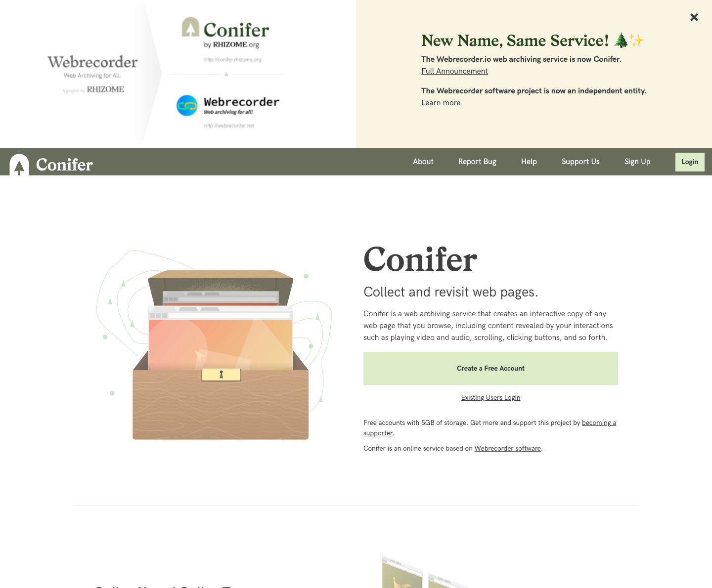
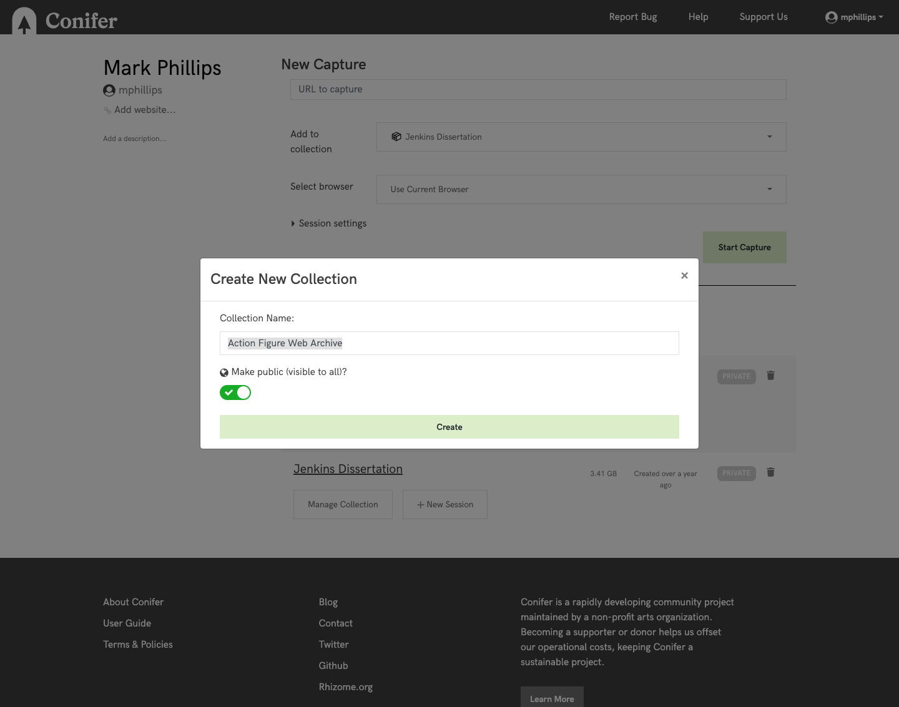
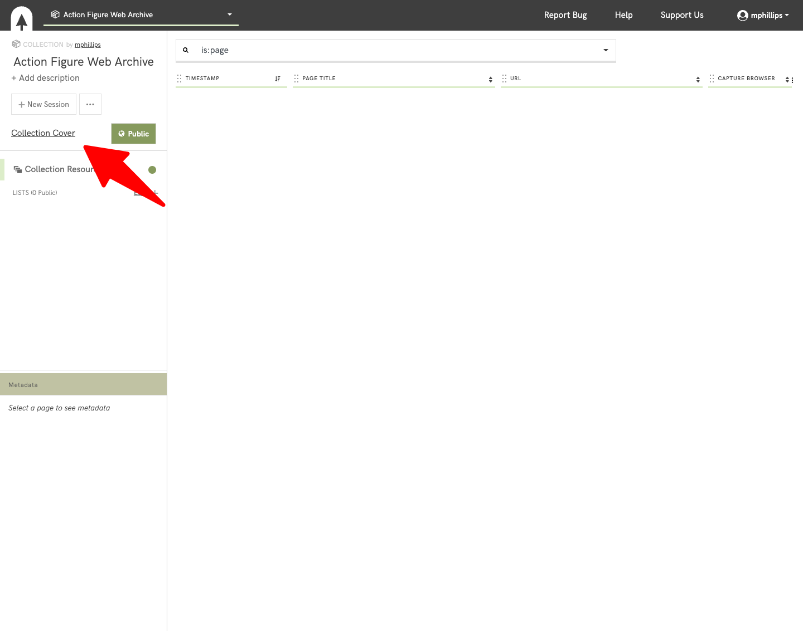
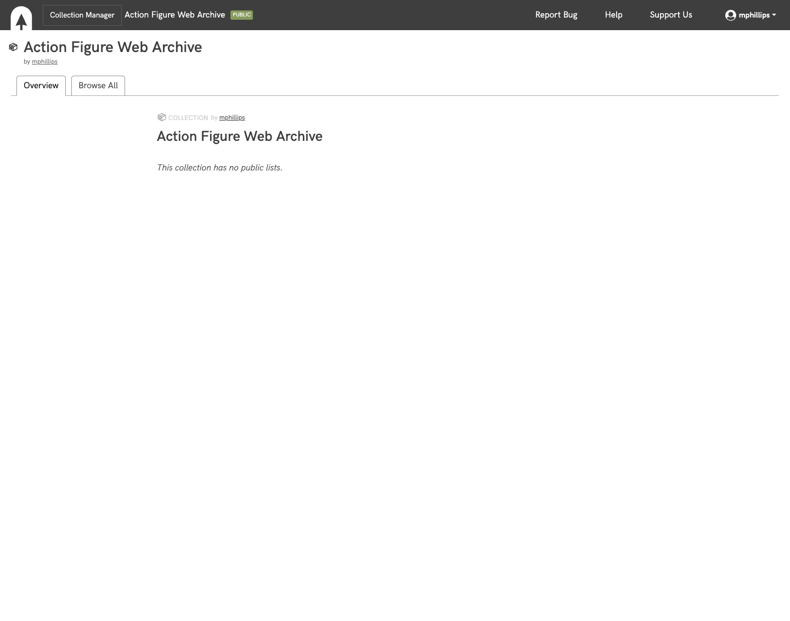

# Module Thirteen - Intellectual Property / Ethics

## Overview and Objectives

### Overview:

The purpose of this module is to become familiar with the ethical considerations to web archives. Ethics is an important component in most aspects of creating collections and web archives has many pieces where ethics and intellectual property are involved. 

In this module, both ethics and intellectual property are discussed. These are two different areas that have some overlap but can often be thought of together.  They don't always align as there are many situations where it might be legal to do something (without copyright restriction, or issues with intellectual property concerns) but it might not be ethical to do so. Another concept that is involved in this space is bias which is also at play in any collection building activity including web archives. 

There are several readings, some online documentation to skim, a few videos to watch, and several power points that you will review. 

### Objectives:

* Familiarize yourself with ethics as they are associated with web archives.
* Understand basic concepts of intellectual property and copyright as they apply to web archives.
* Register and create a public collection in the Conifer tool.

## Readings

The readings this week were selected to give you an introduction to different ways that ethics, legal considerations, and bias come into play within the scope of web archives.  While some fo the readings for this week might seem web archive adjacent, they are all worth considering as you continue to think about building collections of content created by other people, other nations, and other communities. 

### Ethics

* Jules, B., Summers, E., & Mitchell, V. Jr. (2018). Ethical Considerations for Archiving Social Media Content Generated by Contemporary Social Movements: Challenges, Opportunities, and Recommendations. https://www.docnow.io/docs/docnow-whitepaper-2018.pdf 
* Graham, P. (2019). Guest Editorial: Reflections on the Ethics of Web Archiving, Journal of Archival Organization, 14(3-4), 103-110,  https://doi.org/10.1080/15332748.2018.1517589 
* Summers, E. (2014). On Forgetting. https://inkdroid.org/2014/11/18/on-forgetting/ 
* Dolan-Mescal, A. (2017). Opportunities for making appraisal transparent when documenting the now. https://news.docnow.io/opportunities-for-making-appraisal-transparent-when-documenting-the-now-10b807606d39 
* Bingham, N. J., & Byrne, H. (2021). Archival strategies for contemporary collecting in a world of big data: Challenges and opportunities with curating the UK web archive. Big Data & Society https://doi.org/10.1177/2053951721990409 
* George Washington University Libraries. (2018). Social media research ethical and privacy guidelines. https://gwu-libraries.github.io/sfm-ui/resources/social_media_research_ethical_and_privacy_guidelines.pdf 
* National Forum on Ethics & Archiving of the Web - https://eaw.rhizome.org/ 
  * This is a very interesting collection of talks and recorded videos from the event. 
* Digital Curation Ethics (Web Archive) - https://archive-it.org/collections/9982 
  * Collection of papers and projects related to ethics in digital curation
* Kahle, B. (1992). Ethics of Digital Librarianship. https://archive.org/about/ethics_BK.php 
* de Klerk, T.  (2018). Ethics in Archives: Decisions in Digital Archiving. https://www.lib.ncsu.edu/news/special-collections/ethics-in-archives%3A-decisions-in-digital-archiving 

### Legal / Intellectual Property
* Grotke, A. (2012). Legal Issues in Web Archiving. https://blogs.loc.gov/thesignal/2012/05/legal-issues-in-web-archiving/ 
* Brindley, L. (2012).  The memory of a nation in a digital world: Act quickly or our intellectual record will disappear down a black hole. The New Statesman. https://www.newstatesman.com/culture/2012/05/memory-nation-digital-world 
* International Internet Preservation Consortium (2022). Legal Deposit. https://netpreserve.org/web-archiving/legal-deposit/ 
* International Federation of Library Associations and Institutions. (2011). IFLS Statement of Legal Deposit. https://www.ifla.org/publications/ifla-statement-on-legal-deposit-2011/ 
* Association of Research Libraries. (N.D.) Copyright & Fair Use/Fair Dealing https://www.arl.org/category/our-priorities/advocacy-public-policy/copyright-and-fair-use/ 

## Archiving Exercise

### Web Archiving Exercise - Creating a Collection with Conifer

This week we are looking at the Conifer service offered by Rhizome. Many of you will know from our readings that Conifer was developed in partnership with the Webrecorder group and was previously called webrecorder.io.  The service is basically the same as it was and the renaming reflects the changes in governance of the service in relation to other projects. 

For our final project we will be making use of the Conifer service to capture web content as part of the web archives that you have described in your Web Archive Collection Plan. 

For this exercise, you will create a free account with the Conifer service and then create a public collection for the web archive you described in your collection plan. 

Begin by navigating over to https://conifer.rhizome.org/ 

Next, register for a free account with the service.  You will have 5GB of free space on this service and if you don't go wild with your final assignment, this should be sufficient.  If you want to use this service more in the future there are options for more storage with a subscription. 

Once you have created your account you will be given the option to create a collection.  Create a new collection and name it what you chose in your Collection Plan document.  When you are creating the collection click the toggle to make it viewable by everyone.  Here is what my create a collection page looked like. 

After you create the collection you will have a blank collection where you can start capturing items for you collection. 

If you click on the Collection Cover link you will be given the public facing display and the URL that you can share with the class. 

You can then share the link to your public collection. Here is the link to the collection I just created. 

https://conifer.rhizome.org/mphillips/action-figure-web-archive

If you want to explore different ways you can add additional information to your new collection feel free.  There is a way of adding a description about the collection and possibly other options you can make use of. 

And that is all that you need to do for this week's exercise.  In this weeks discussion you can post the link to your public collection as an example of what you will be working on for the final project.  The public collection allows us all to see the work you are doing more easily. 

## Exploring Web Archives

Each week we will try and learn about a new web archive, a web archiving tool, or a web archiving service.  The goal of this is to get an introduction to what is happening in the web archiving space, what is being collected, and who is collecting it. 

This week we will look at the output of the membership of the International Internet Preservation Consortiums' members. 

https://netpreserve.org/about-us/members/

Because many of these libraries are national libraries, they are operating under their local copyright and intellectual property laws.  Many of them have some sort of legal mandate in place for collecting resources but not all of them have the ability to display all of the content that they collect. 

Take some time to explore the members and try to navigate to their institutions' web archive if possible. You will notice some familiar groups like Australia, UKWA, Arquivo.pt, and the Library of Congress that we have looked at in past weeks.  In your reporting out in the discussion this week, pick a web archiving institution other than one of the ones we have seen so far in previous module's Exploring Web Archives sections. 

## Discussion

### Discussion Post:
In at least one paragraph, discuss what you learned this week about ethics and intellectual property in relation to web archives. Had you thought much about this aspect previously in the course? Are there things like restricted access to some web archives that you see differently based on the readings this week? What are your thoughts about legal mandates to collect web content as a component of preserving culture and intellectual output of a nation?

In at least one paragraph discuss this week's exercise with Conifer. Did you run into any problems with setting up an account? Post a link to your collection and give the class a brief overview of the collection you will be creating based on your Collection Plan. 

Finally, in at least one paragraph, identify one of the members of the IIPC that you haven't already looked at as part of a previous module's Exploring Web Archive.  What did you learn about that member? What kind of library is it, national, research, archive, commercial service? What kinds of web archives do they collect?  What do they have online.  Link to the member's local institution's pages on their web archiving initiative if possible. 

### Class Engagement:

After you have made the discussion post described above, take the time to response, comment, or engage with at least **two** of your classmates posts.  

If there are any unanswered questions feel free to try and offer an answer or suggestion to the original poster.  Did they mention something that made you investigate something further? If so, what was it? 
