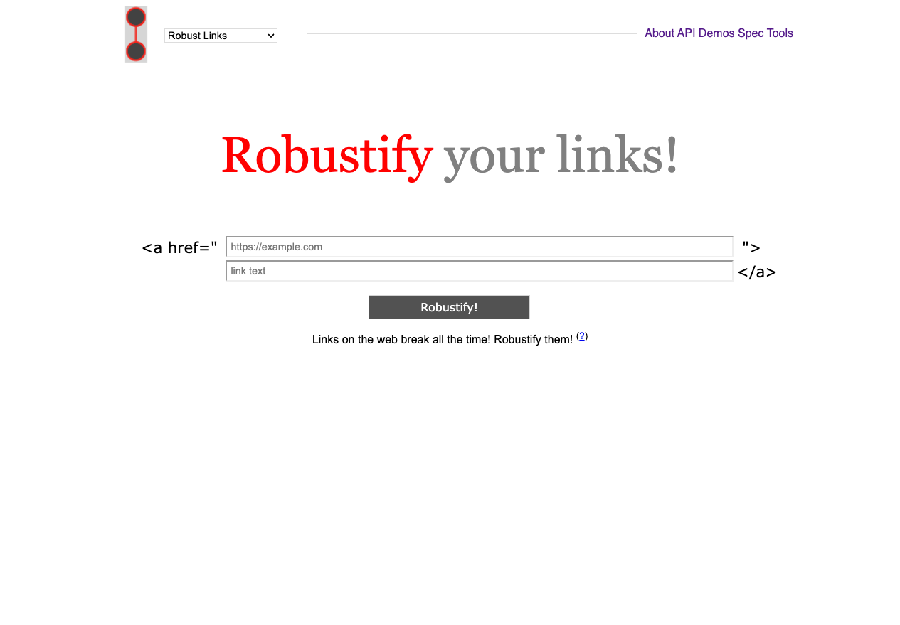
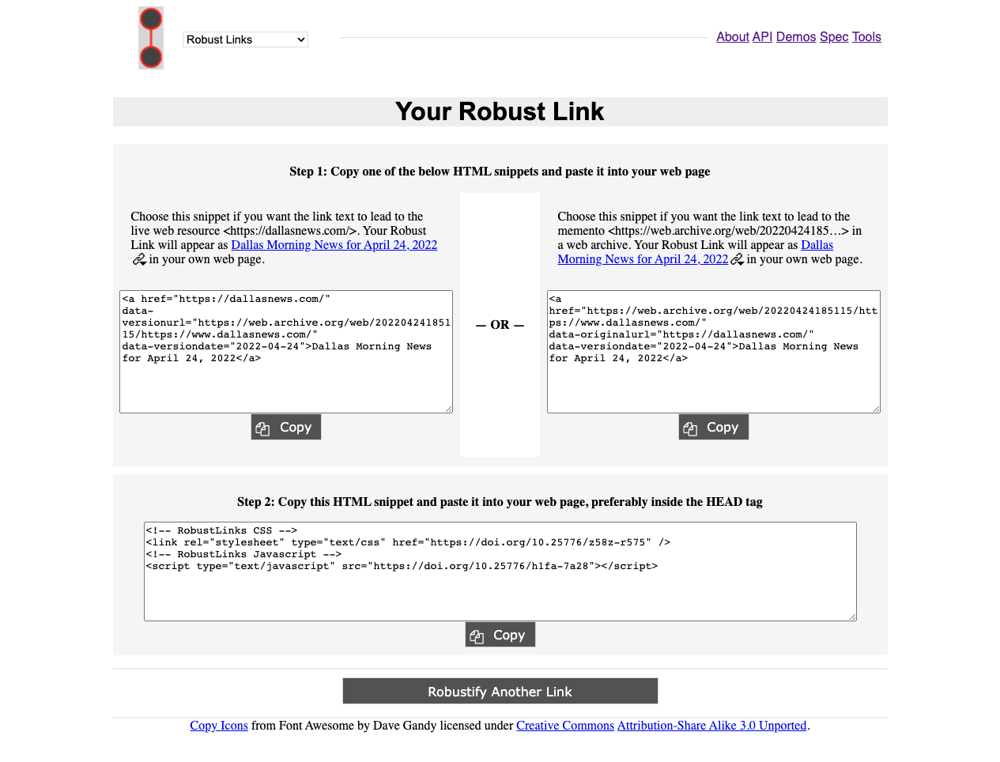

# Module Fourteen - Future of Web Archives

## Overview and Objectives

Overview:
The purpose of this module is to introduce some of the emerging areas of web archive, or possibly web archiving adjacent activities that may change how the field does the things it does.  This module will present several initiatives that are in current development as well as some example of recent projects in the broad scope of web archiving. 

There are several readings, some online documentation to skim, a few videos to watch, and several power points that you will review. 

Objectives:
1. Introduce projects that may have an effect on web archiving in the future.
2. Become aware of the concept of Robust Links.
3. Create and share an example of a Robust Link with the class.

## Readings

The readings this week were selected to give you an introduction to different projects that are on the periphery of the web archiving space that we have not been able to cover in great depth so far in this course.  Many of them you may have run across in previous readings but this is an opportunity for you to learn more about them in this module. 

### General Readings
* Lynch, C. (2022). The Dangerous Complacency of “Web Archiving” Rhetoric. Against the Grain 33(6) https://www.charleston-hub.com/2022/01/the-dangerous-complacency-of-web-archiving-rhetoric/
* Lynch, C. (2017) Stewardship in the "Age of Algorithms". First Monday 22(12). https://doi.org/10.5210/fm.v22i12.8097

### Robust Links
* https://robustlinks.mementoweb.org/ (Links to an external site.)
  * About the Project - https://robustlinks.mementoweb.org/about/
  * Specification - https://robustlinks.mementoweb.org/spec/
* Sanderson, R., Phillips, M., & Van de Sompel H. (2011). Analyzing the Persistence of Referenced Web Resources with Memento. In proceedings Open Repositories 2011 Conference. 
  * ArXiv Link - https://doi.org/10.48550/arXiv.1105.3459
  * UNT Digital Library - https://digital.library.unt.edu/ark:/67531/metadc39318/

### Signposting
* https://signposting.org/ (Links to an external site.)
  * About the Project - https://signposting.org/#about
Klein, M., Shankar, H., & Van de Sompel H. (2018). Signposting for Repositories. In proceedings Joint Conference on Digital Libraries.  https://doi.org/10.1145/3197026.3203879
  * UNT Direct Link - https://dl-acm-org.libproxy.library.unt.edu/doi/10.1145/3197026.3203879
* Klein, M., Van de Sompel, H., Sanderson, R., Shankar, H., Balakireva, L., Zhou, K., & Tobin, R. (2014) Scholarly Context Not Found: One in Five Articles Suffers from Reference Rot. PLOS ONE 9(12): e115253. https://doi.org/10.1371/journal.pone.0115253 (Links to an external site.)

### Web Archive Collection Zipped (WACZ) 
* Summers, Ed. (2021). Web Archives on, of, and off, the Web. https://inkdroid.org/2021/11/24/wacz/
* Open Knowledge Foundation. (2022). Ilya Kreymer's and Ed Summers' presentation about standardising the WACZ format 
https://www.youtube.com/watch?v=TIyOTEyAu7k (Links to an external site.)
* Specification - https://webrecorder.github.io/wacz-spec/1.1.1/

## Archiving Exercise

### Web Archiving Exercise - Robust Links

One of the most powerful, and at the same time most fragile thing that makes the web possible is the mechanism that is used for connecting resource, links.  These are the basis of the web and we use them all the time without thinking about them. That is, until they do not work for us and we get a 404 error and have to figure out what to do next. 

In addition to just missing pages, there are some situations when the specific version of a website is important to reference. We accomplish this in writing with citations and references that display when a URL was last referenced.  There are other approaches to this problem space that we will explore in this exercise. 

First, head over to the Robustify service. 

https://robustlinks.mementoweb.org/ (Links to an external site.)



Choose a website you want to link to with a specific date and time.  

After you entry your link and the text you want the link to say, you hit submit and the service will begin doing its work. 

")

In my example I have chosen a link to the Dallas Morning News (https://dallasnews.com (Links to an external site.)) for April 24, 2022. 

Once the service has completed you will be provided with the following screen. 



You have some options for how you can choose to display your new robust link.  

For the discussion this week you will share the code for your Robust link in its snippet form.  You can use the <preformatted> option like you see below. 

```
<a href="https://dallasnews.com/"
data-versionurl="https://web.archive.org/web/20220424185115/https://www.dallasnews.com/"
data-versiondate="2022-04-24">Dallas Morning News for April 24, 2022</a>
```

## Exploring Web Archives

Each week we will try and learn about a new web archive, a web archiving tool, or a web archiving service.  The goal of this is to get an introduction to what is happening in the web archiving space, what is being collected, and who is collecting it. 

This week is an open week for identifying a web archive collection that you haven't previously mentioned in your discussion postings and share it with the class. This can be a collection from a larger service such as Archive-It (https://archive-it.org/ (Links to an external site.)) , or the Library of Congress Web Archive Collections (https://www.loc.gov/web-archives/collections/ (Links to an external site.)) but if there are others you want to explore feel free. 

In the discussion this week you will identify the web archive collection you have identified and at least two example URLs of content in that web archive.

## Discussion
  
### Discussion Post:
In at least one paragraph, discuss what you learned this week from the readings. Discuss your opinions of the Clifford Lynch articles.  How do they or do they not alight with your thinking so far in this course?

In another paragraph share what did you learn from the other examples in the module's readings.  Have you come across any of them before in this course? What do you think the future of web archiving holds?

In at least one paragraph discuss this week's exercise with Robust Links.  What is the point of this tool/service/specification? What website did you create a link for? Share your Robust Links in your discussion using the <preformatted> style to show the code snippet.  Where do you think this kind of service fits into the web archiving and scholarly communication landscape. 

Finally, in at least one paragraph, introduce the web archive collection you found in the Exploring Web Archives section from this week.  Who created the collection? What is the scope of the collection? Include the URL for the collection and then include two example URLs from content within that collection. 

### Class Engagement:

After you have made the discussion post described above, take the time to response, comment, or engage with at least **two** of your classmates posts.  

If there are any unanswered questions feel free to try and offer an answer or suggestion to the original poster.  Did they mention something that made you investigate something further? If so, what was it? 
  
